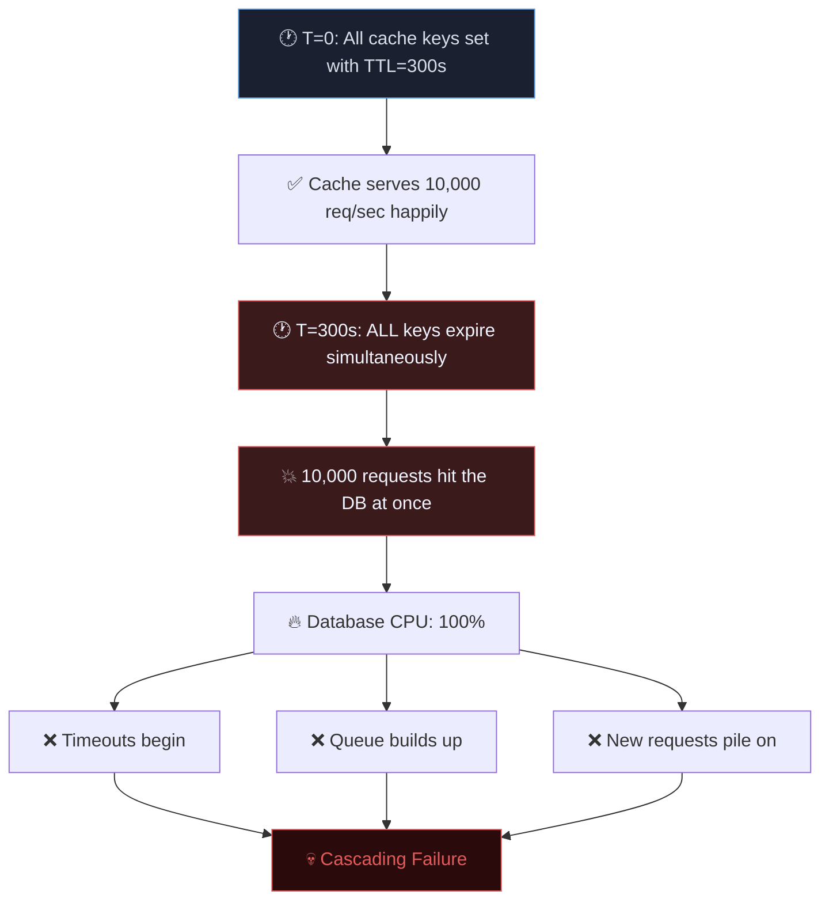
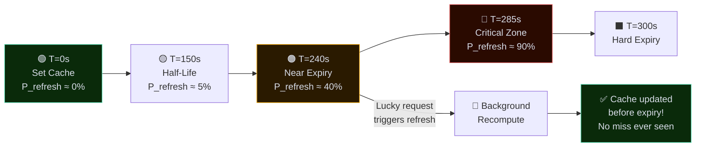
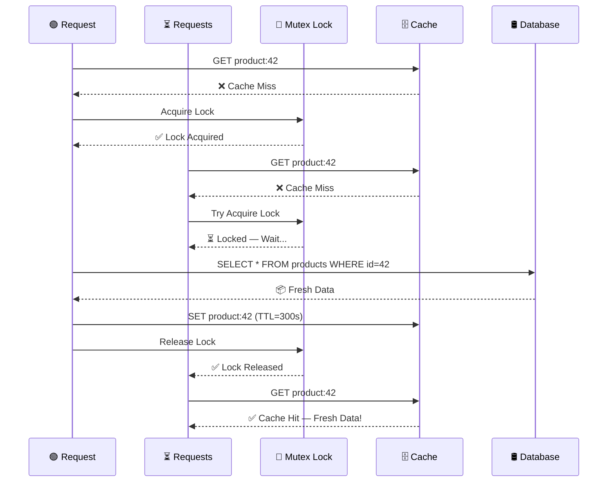
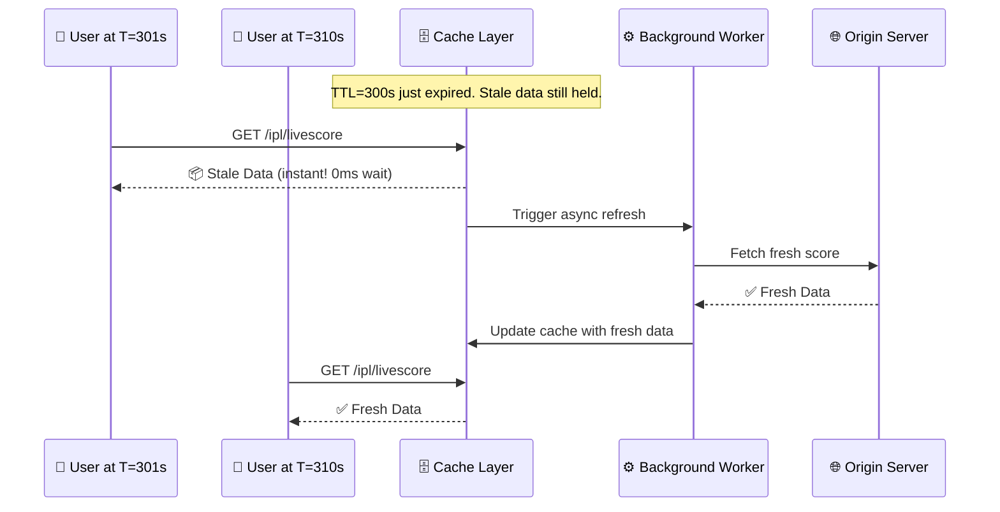
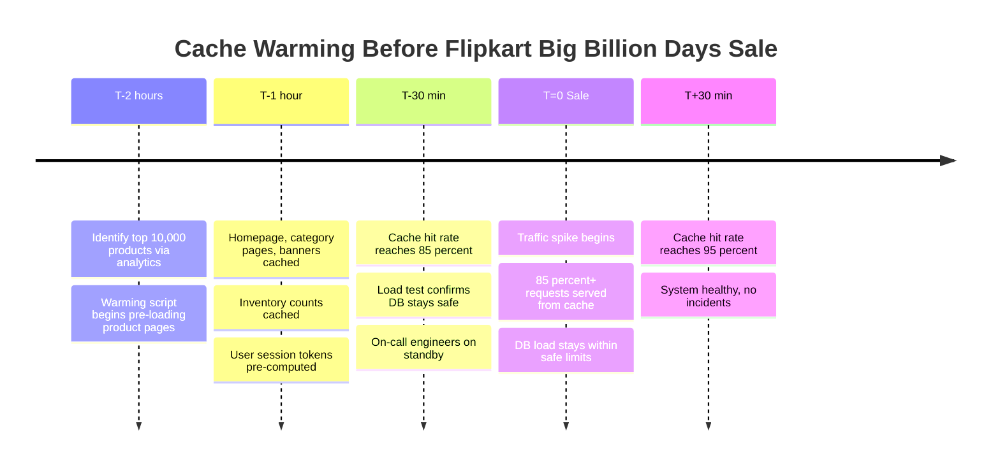
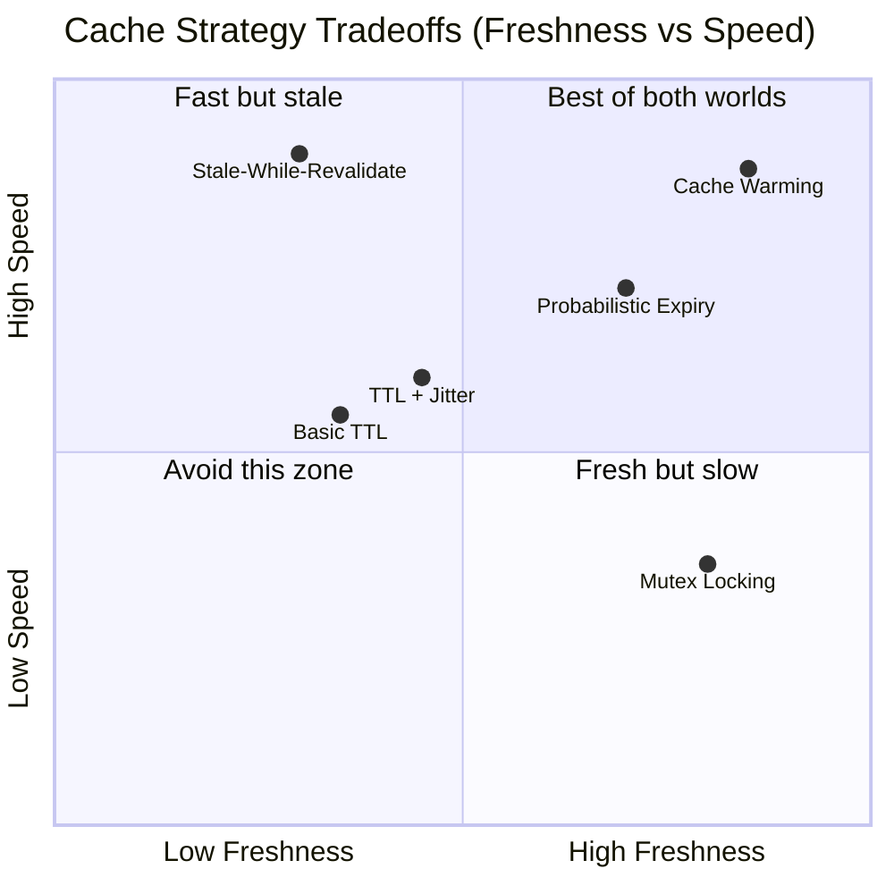
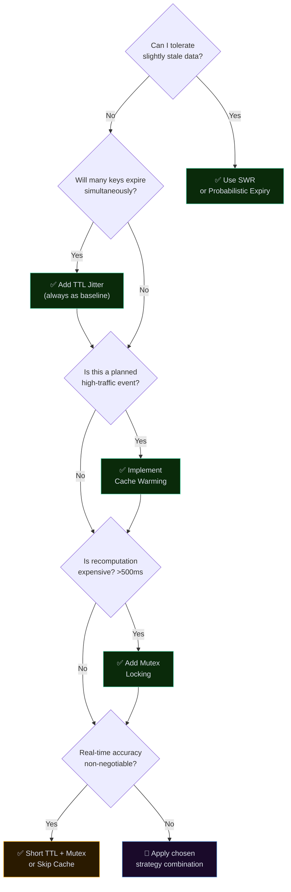

# When the Cache Lies, Everything Burns
### Advanced Cache Strategies in Distributed Systems

> *"A cache is not a safety net. Without the right strategy, it is a ticking time bomb."*

---

## 🗺️ Blog Mind Map

```markmap
---
title: Cache Strategies in Distributed Systems
---

# Cache Strategies in Distributed Systems

## Why Basic TTL Fails
- Synchronized Expiry
  - All keys set same TTL → expire together
  - Mass cache-miss event
- Cold Start Problem
  - Cache restart = zero warmth
  - All requests hit DB at once
- Last Mile Lag
  - Stale data served just before expiry
  - Expensive recomputation spike after

## The Thundering Herd
- Root Cause: Temporal Correlation
- All clients see expiry at same time
- DB receives wall of queries
- Cascading failure risk
- Real Examples
  - IPL Live Score (Hotstar)
  - Netflix midnight release
  - Flipkart Big Billion Days

## Strategy 1: TTL Jitter
- Add random offset to TTL
  - `TTL = base + random(-30, +30)`
- Spreads expiry across time window
- Full Jitter vs Equal Jitter
- AWS recommends Full Jitter
- Eliminates synchronized thundering herd

## Strategy 2: Probabilistic Early Expiration
- XFetch Algorithm
- Refresh probability increases near expiry
- Background recompute before hard expiry
- β controls aggressiveness
- Ideal for slow-to-compute data

## Strategy 3: Mutex / Cache Locking
- Only 1 request recomputes
- Others wait → benefit from fresh cache
- Distributed Mutex via Redis (Redlock)
  - `SET key value NX PX timeout`
- Adds latency for waiting requests
- Always set TTL on the lock itself

## Strategy 4: Stale-While-Revalidate
- Serve stale data instantly
- Trigger background refresh
- Next request gets fresh data
- Used by Cloudflare, Fastly, Akamai
  - `Cache-Control: max-age=300, stale-while-revalidate=60`
- Vercel SWR library
- Not suitable for financial / medical data

## Strategy 5: Cache Warming
- Pre-load before traffic spike
- Types
  - Predictive Warming
  - Replay-Based Warming
  - Hot-Standby Warming
- Netflix CDN pre-warming
- Flipkart sale pre-loading
- IPL match preparation

## Tradeoffs Triangle
- Freshness vs Latency vs Consistency
- Echoes CAP Theorem
- No strategy wins all three
- Choose based on tolerance

## When to Use Which
- IPL Live Score → Jitter + Mutex
- E-commerce Sale → Warming + SWR
- Netflix Release → Warming + CDN SWR
- Bank Balance → Mutex + Short TTL
- Analytics Dashboard → SWR + Probabilistic
- Social Feed → SWR + Jitter
```

---

## Introduction — The Night Netflix Almost Broke the Internet

It's 11:59 PM. Millions of viewers across the world are waiting to watch the season finale of a hit show. The clock hits midnight. Everyone clicks **"Play"** at the same time. Netflix's cache — which was happily serving data for the last hour — suddenly expires. Every single server rushes to the database to fetch fresh data. The database chokes. The app slows down. Twitter explodes with complaints.

This scenario has a name. Engineers call it the **Thundering Herd Problem**. And basic TTL caching is its accomplice.

We've all learned the basics of caching: store expensive computation results, set a Time-To-Live (TTL), serve from cache, and let it expire. Simple. Clean. Beautiful.

**Until it isn't.**

In distributed systems — where thousands of users hit hundreds of servers simultaneously — naive caching can be worse than no caching at all. This blog takes you deep into the battle-tested strategies that companies like Netflix, Amazon, and Hotstar use to keep their systems alive during traffic spikes.

---

## 📑 Table of Contents

1. [Why Basic TTL Caching Is Not Enough](#1-why-basic-ttl-caching-is-not-enough)
2. [How Cache Expiry Causes Traffic Spikes — The Thundering Herd](#2-how-cache-expiry-causes-traffic-spikes--the-thundering-herd)
3. [TTL Jitter — Adding Randomness to Expiration](#3-ttl-jitter--adding-randomness-to-expiration)
4. [Probability-Based Early Expiration](#4-probability-based-early-expiration)
5. [Mutex / Cache Locking](#5-mutex--cache-locking--only-one-request-allowed)
6. [Stale-While-Revalidate (SWR)](#6-stale-while-revalidate-swr--serve-old-refresh-quietly)
7. [Cache Warming / Pre-Warming](#7-cache-warming--pre-warming--fill-before-the-flood)
8. [Tradeoffs: Freshness vs Latency vs Consistency](#8-the-eternal-triangle-freshness-vs-latency-vs-consistency)
9. [When to Use Which Strategy](#9-when-to-use-which-strategy)

---

## 1. Why Basic TTL Caching Is Not Enough

Caching is one of the oldest tricks in computing. The idea is elegant: instead of computing or fetching the same data over and over, store it somewhere fast (like RAM) and reuse it.

TTL (Time-To-Live) makes cached data self-cleaning. You set a timer — say, 5 minutes — and after that, the data is considered stale and gets evicted. The next request triggers a fresh fetch.

> 🚀 **Amazing Fact:** Accessing data from RAM takes ~100 nanoseconds. Fetching it from a database over the network takes ~10 milliseconds. That's a **100,000× speed difference**. A single cache hit can save the time it takes light to travel 3 kilometres!

### The Three Quiet Killers of Basic TTL

| Problem | What Happens | Impact |
|---|---|---|
| ⚡ Synchronized Expiry | All keys set at same time expire together | Mass cache-miss flood to DB |
| 🧊 Cold Start Problem | Cache restart = zero cached data | Every request hits origin |
| ⏳ Last Mile Lag | Stale data served just before expiry | Expensive recomputation spike after |

> ⚠️ **The Brutal Truth:** A cache that protects you during normal traffic can *amplify* the damage during a traffic spike. That's the paradox of naive TTL caching in production.

> *"A cache is not a safety net. Without the right strategy, it is a ticking time bomb."*

---

## 2. How Cache Expiry Causes Traffic Spikes — The Thundering Herd

Imagine a popular IPL match. Hotstar has cached the live score for all 50 million viewers. TTL is set to 10 seconds. At exactly T=10 seconds, the cache expires for **everyone**. All 50 million clients simultaneously fire a request to the database server for updated scores.

The database sees a wall of 50 million queries in a fraction of a second. It was not designed for this. It falls to its knees. Welcome to the **Thundering Herd**.

### Diagram — Thundering Herd Flow



> 📊 **Real-World Numbers:** During Amazon Prime Day 2023, Amazon handled over **375 million items sold** in 48 hours. Without intelligent caching, even a 0.01-second delay per request would cascade into billions of dollars in lost revenue. Cache strategy is not a developer concern — it's a business survival concern.

The core issue is **temporal correlation**: too many cache entries share the same expiry timestamp. It's like all your milk cartons in a grocery store having the same expiry date — when they all go bad at once, no amount of restocking can keep up.

> *"The thundering herd doesn't knock at the door. It kicks it down. The moment your cache expires, your database becomes the emergency room."*

---

## 3. TTL Jitter — Adding Randomness to Expiration

The fix for synchronized expiry is beautifully simple: **don't let everything expire at the same time.**

Instead of setting every cache entry with exactly 300 seconds TTL, you add a random offset — the "jitter":

```
TTL = base_ttl + random(-30, +30)
```

So instead of 10,000 keys all expiring at T=300, they now expire between T=270 and T=330. Your database receives a smooth, manageable stream of refresh requests instead of one catastrophic spike.

### Diagram — Synchronized vs Jittered TTL

```mermaid
gantt
    title Synchronized TTL vs Jittered TTL Expiry Timeline
    dateFormat X
    axisFormat %ss

    section ❌ Without Jitter
    Key-1 (cache active)   :done,    0, 300
    Key-2 (cache active)   :done,    0, 300
    Key-3 (cache active)   :done,    0, 300
    Key-4 (cache active)   :done,    0, 300
    DB SPIKE 💥            :crit,    300, 315

    section ✅ With Jitter
    Key-1 (active)         :active,  0, 272
    Key-2 (active)         :active,  0, 288
    Key-3 (active)         :active,  0, 306
    Key-4 (active)         :active,  0, 321
    Smooth Refreshes       :         272, 330
```



### Full Jitter vs Equal Jitter

AWS published a famous blog post *"Exponential Backoff And Jitter"* recommending **Full Jitter** for cache TTLs — where expiry time is completely randomized within a range. This dramatically reduces contention on backend services.

> 🧠 **Concept Insight:** The same "jitter" principle is used in network retry logic. When Wi-Fi routers all try to retransmit after a collision, they use random backoff timers (CSMA/CD) — exactly the same idea as TTL jitter. Physics and distributed systems share the same wisdom.

> *"Randomness is not chaos. In distributed systems, a little randomness is the cure for synchronized disaster."*

---

## 4. Probability-Based Early Expiration

Jitter solves synchronized expiry. But there's still an issue: when a key expires, the next request **always waits** for full recomputation before being served. What if we could start recomputing *before* the entry actually expires?

Enter **Probabilistic Early Expiration** — also called the **XFetch algorithm**.

### The Core Idea

As a cached value gets closer to its TTL, individual requests are given an increasing *probability* of triggering a background refresh. Early requests have a low chance. Requests arriving just before expiry have a very high chance.

Think of it like a candle burning down. Most people keep using the room's light. But as the candle gets shorter, someone preemptively goes to get a new one — *before* the room goes dark.

### Diagram — Probability-Based Early Expiration



> 🔬 **The Math (Light Version):** The XFetch formula is: **recompute if `(now − expiry) > −β × δ × log(rand())`** — where β controls how aggressively early we refresh, and δ is the recomputation time. The longer the recomputation takes, the earlier the algorithm starts refreshing. Simple, elegant, powerful.

> *"Don't wait for the cache to run dry. A wise system refills the well before anyone gets thirsty."*

---

## 5. Mutex / Cache Locking — Only One Request Allowed

100 requests arrive simultaneously. The cache just expired. All 100 see a cache miss. All 100 rush to the database. The database runs the same expensive query 100 times. It's computational waste and database abuse combined.

The solution: **only let one request do the expensive work. Everyone else waits.**

A **Mutex (Mutual Exclusion Lock)** says: "Only one thread/request can enter this critical section at a time."

### How It Works

1. Request #1 sees cache miss → acquires the mutex lock
2. Requests #2–#100 see cache miss → try to acquire lock → **blocked, they wait**
3. Request #1 fetches fresh data from DB → populates cache
4. Request #1 releases the lock
5. Requests #2–#100 now read **fresh data from cache** — cache hit! ✅

### Diagram — Mutex Cache Locking Flow



### Distributed Mutex with Redis

In distributed systems, a regular in-process mutex doesn't work — Request #1 might be on Server A, while Request #2 is on Server B. You need a **distributed lock** — typically via Redis's `SET key value NX PX timeout` command (the **Redlock algorithm**).

> ⚠️ **Watch Out:** Mutex adds latency for waiting requests. If the lock holder crashes before releasing, the lock TTL saves you. Always handle "lock timeout" gracefully — don't let waiting requests starve forever.

> *"When everyone rushes to do the same work, no work gets done well. One worker, one job, everyone benefits."*

---

## 6. Stale-While-Revalidate (SWR) — Serve Old, Refresh Quietly

Mutex makes users wait. That's sometimes unacceptable. There's a better philosophy for many use cases:

> *"Give the user slightly stale data instantly. Refresh in the background. Next request gets fresh. Nobody waited."*

**Stale-While-Revalidate (SWR)** separates "serving" from "refreshing." When a request arrives for expired data:

1. **Immediately return the stale (old) value** — zero latency for the user
2. **Simultaneously trigger a background refresh**
3. **Next request gets the fresh value**

This is exactly how modern CDNs work. Cloudflare, Fastly, and Akamai all support SWR via HTTP headers:

```
Cache-Control: max-age=300, stale-while-revalidate=60
```

### Diagram — Stale-While-Revalidate Flow



> 🌍 **Real-World Adoption:** The SWR pattern is so popular that Vercel named their famous React data-fetching library after it — **SWR** — with over 28,000 GitHub stars. The pattern is used by Netflix, Twitter/X, and virtually every major CDN on the planet.

### When SWR Works Best

| ✅ Good Fit | ❌ Bad Fit |
|---|---|
| Leaderboards & scores | Bank balances |
| News feeds | Stock prices |
| Product listings | Medical records |
| Analytics dashboards | Real-time inventory |
| Social media feeds | Payment data |

> *"Users don't need perfect data instantly. They need data instantly. Perfection can arrive in the background."*

---

## 7. Cache Warming / Pre-Warming — Fill Before the Flood

It's the morning of a massive e-commerce sale — think Flipkart Big Billion Days. Engineers know that at 12:00 AM, lakhs of users will flood the platform. If the cache is cold (empty), those first requests will hit the database with full force. The first 10 minutes could be catastrophic.

The solution? **Don't wait for users to warm the cache. Warm it yourself.**

**Cache Warming** (also called Pre-Warming or Cache Priming) is the practice of proactively loading frequently accessed data into the cache *before* traffic arrives.

### Three Warming Approaches

| Approach | How It Works | Best For |
|---|---|---|
| 📋 **Predictive Warming** | Pre-load data based on historical patterns | Scheduled launches, sales, sports |
| 🔁 **Replay-Based Warming** | Replay yesterday's traffic logs against new cache | New cache node deployment |
| 🤝 **Hot-Standby Warming** | Shadow live traffic to new node before cutover | Rolling cache cluster upgrades |

### Diagram — Cache Warming Timeline Before a Sale



> 🎬 **Netflix Case Study:** When Netflix releases a new season at midnight, they pre-warm CDN caches globally **hours before the release**. Video chunks, thumbnail images, metadata — all pushed to edge nodes before the surge. This is why Netflix releases rarely stutter on launch night, despite tens of millions of simultaneous viewers.

> *"A firefighter doesn't fill the hose when the building is already burning. Fill your cache before the traffic arrives."*

---

## 8. The Eternal Triangle: Freshness vs Latency vs Consistency

Every caching strategy is a negotiation between three forces that are always in tension:

- **🕐 Freshness** — How recent is the data? Shorter TTLs = fresher data but more backend pressure.
- **⚡ Latency** — How fast is the response? More caching = lower latency but potential staleness.
- **🔒 Consistency** — Do all users see the same data? Distributed caches can serve different versions.

You cannot fully optimize all three simultaneously. Every strategy picks its priorities:

### Diagram — Strategy Tradeoff Comparison



### Full Comparison Table

| Strategy | Freshness | Latency | Consistency | Complexity |
|---|---|---|---|---|
| Basic TTL | 🟡 Medium | 🟢 High | 🔴 Low | 🟢 Simple |
| TTL + Jitter | 🟡 Medium | 🟢 High | 🟡 Medium | 🟢 Simple |
| Probabilistic Early Exp. | 🟢 High | 🟢 High | 🟡 Medium | 🟡 Medium |
| Mutex Locking | 🟢 High | 🟡 Medium | 🟢 High | 🟡 Medium-High |
| Stale-While-Revalidate | 🔴 Low-Med | 🟢 Very High | 🔴 Low | 🟡 Medium |
| Cache Warming | 🟢 High | 🟢 Very High | 🟢 High | 🔴 High |

> 📐 **CAP Theorem Echo:** This tradeoff triangle echoes the famous **CAP Theorem** in distributed systems  
> (Consistency, Availability, Partition Tolerance — pick 2).  
Caching has its own version: Freshness, Latency, Consistency — and no strategy wins all three.

---

## 9. When to Use Which Strategy

### Mind Map — Decision Guide


```markmap
---
title: Cache Strategy Decision Guide
---

# Which Cache Strategy?

## Can I tolerate slightly stale data?
### YES → Consider SWR
- Leaderboards
- News feeds
- Social media
- Analytics dashboards
### YES → Also consider Probabilistic Expiry
- Slow-to-compute data
- ML model results
- Complex aggregations
### NO → Need fresh data always
- Go to: Will many keys expire together?

## Will many keys expire simultaneously?
### YES → Always add TTL Jitter
- Applies to ALL strategies as a baseline
- Full Jitter preferred over Equal Jitter
### NO → Single hot key
- Use Mutex Locking alone

## Is this a planned high-traffic event?
### YES → Cache Warming mandatory
- Flipkart Big Billion Days
- IPL Match Start
- Netflix Season Drop
- Product Launch
### NO → Rely on organic warming

## Is recomputation expensive? (>500ms)
### YES → Add Mutex Locking
- Prevents duplicate DB queries
- Redis Redlock for distributed systems
### NO → Basic TTL + Jitter sufficient

## Is real-time accuracy non-negotiable?
### YES → Short TTL + Mutex OR skip cache
- Bank balances
- Stock trading
- Medical records
- Live auctions
### NO → Any strategy works

## Real-World Mappings
### IPL Live Score → Jitter + Mutex
### E-commerce Sale → Warming + SWR
### Netflix Drop → Warming + CDN SWR
### Bank Balance → Mutex + Short TTL
### Analytics Board → SWR + Probabilistic
### Social Feed → SWR + Jitter
### New Cache Node → Replay Warming
```

---

### Quick Reference Table

| Scenario | Recommended Strategy | Why |
|---|---|---|
| 🏏 **IPL Live Score** | TTL Jitter + Mutex | Millions hit same key; spread expiry + prevent duplicate DB hits |
| 🛒 **E-commerce Flash Sale** | Cache Warming + SWR | Pre-load top products; slight price staleness is acceptable |
| 🎬 **Netflix New Release** | Cache Warming + CDN SWR | Push metadata to edges hours before; background refresh for updates |
| 🏦 **Bank Balance Query** | Mutex + Short TTL (or no cache) | Consistency is non-negotiable; staleness = compliance violation |
| 📊 **Analytics Dashboard** | SWR + Probabilistic Expiry | Fast response > freshness; proactive refresh for slow aggregations |
| 🔄 **New Cache Node** | Hot-Standby / Replay Warming | Avoid cold-start catastrophe before going live |
| 📱 **Social Media Feed** | SWR + Jitter | Content needn't be millisecond-fresh; spread load; serve fast |
| 🎮 **Game Leaderboard** | SWR + Probabilistic Expiry | Eventual consistency fine; high read volume needs low latency |

---

### The 5-Question Decision Flow



> *There is no universal best cache strategy.  
There is only the right strategy for your data's freshness needs,  
your users' latency tolerance, and your database's capacity for pain.*

---

## Conclusion — Cache Smart or Cache Sorry

We started with a story about Netflix and ended with a decision framework.  
The journey in between was a walk through the real battle-scars of distributed systems engineering.

### The Complete Strategy Mind Map


```markmap
---
title: Cache Strategies — Final Summary
---

# Cache Strategies Summary

## 🔴 The Problem
- Basic TTL creates Thundering Herd
- Synchronized expiry = mass DB flood
- Cold start = zero protection at launch

## 🟡 Strategy 1: TTL Jitter
- Spread expiry randomly
- `TTL = base + random(-30s, +30s)`
- Full Jitter preferred
- ✅ Always use as baseline in production

## 🟡 Strategy 2: Probabilistic Early Expiration
- XFetch algorithm
- Probability of refresh grows near TTL
- Background refresh before hard expiry
- ✅ Use for slow-to-compute, high-read data

## 🟡 Strategy 3: Mutex Locking
- Only 1 request recomputes on miss
- Others wait → then read fresh cache
- Redis Redlock for distributed systems
- ✅ Use when recomputation is expensive

## 🟡 Strategy 4: Stale-While-Revalidate
- Serve stale instantly → refresh async
- CDN native support
- `Cache-Control: stale-while-revalidate`
- ✅ Use when slight staleness is acceptable

## 🟡 Strategy 5: Cache Warming
- Pre-load before traffic arrives
- Predictive / Replay / Hot-Standby
- Netflix, Flipkart, IPL use this
- ✅ Mandatory for planned traffic spikes

## 🟢 The Golden Rules
- Always add jitter in production
- Warm before every major launch
- Match staleness tolerance to data type
- Use mutex for expensive recomputation
- Combine strategies for real systems
- Monitor hit rate, miss rate, latency

## 🌟 Closing Insight
- Stack Overflow runs on 1 server
- Strategy beats hardware, every time
- The best cache is the one users never notice
```

### What We Learned

| Strategy | One-Line Summary |
|---|---|
| 🎯 TTL Jitter | Spread expiry times randomly. Always use in production. |
| 🔮 Probabilistic Expiry | Refresh proactively as TTL approaches. Prevent last-mile spikes. |
| 🔐 Mutex Locking | One request recomputes, all others benefit. Prevent duplicate DB work. |
| ♻️ Stale-While-Revalidate | Serve old instantly, refresh in background. Zero user-perceived latency. |
| 🔥 Cache Warming | Fill the cache before traffic arrives. Highest-leverage for planned spikes. |
| ⚖️ Tradeoffs | Freshness, Latency, Consistency — no strategy wins all three. Choose wisely. |

---

> 🌟 Stack Overflow — one of the world's most visited developer websites —  handles **95% of its requests from a single on-premise server**, largely because of masterful caching. Meanwhile, some startups with far less traffic use 50 servers and still struggle.  **Strategy beats hardware, every time.**

---

> *Cache is not about storing data.  
It's about designing for failure before failure arrives.  
The best cache strategy is the one your users never notice — because nothing ever went wrong.*

---


