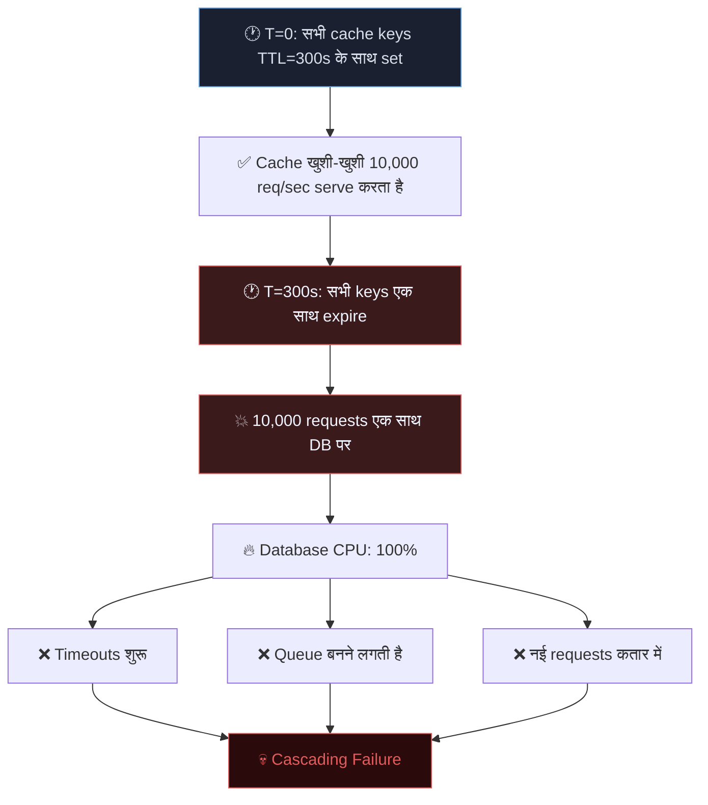
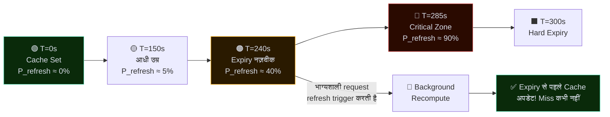
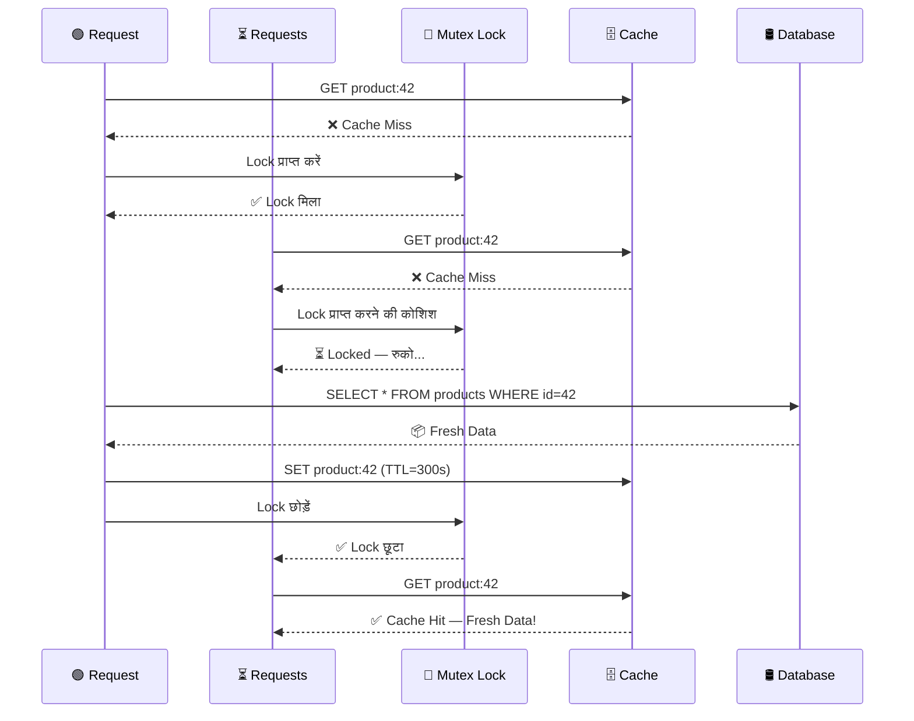
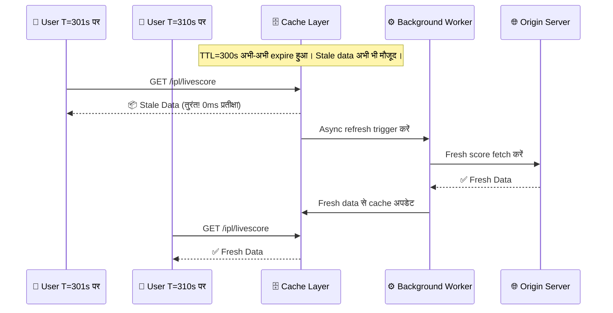
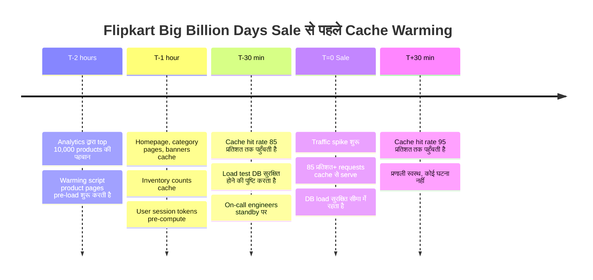
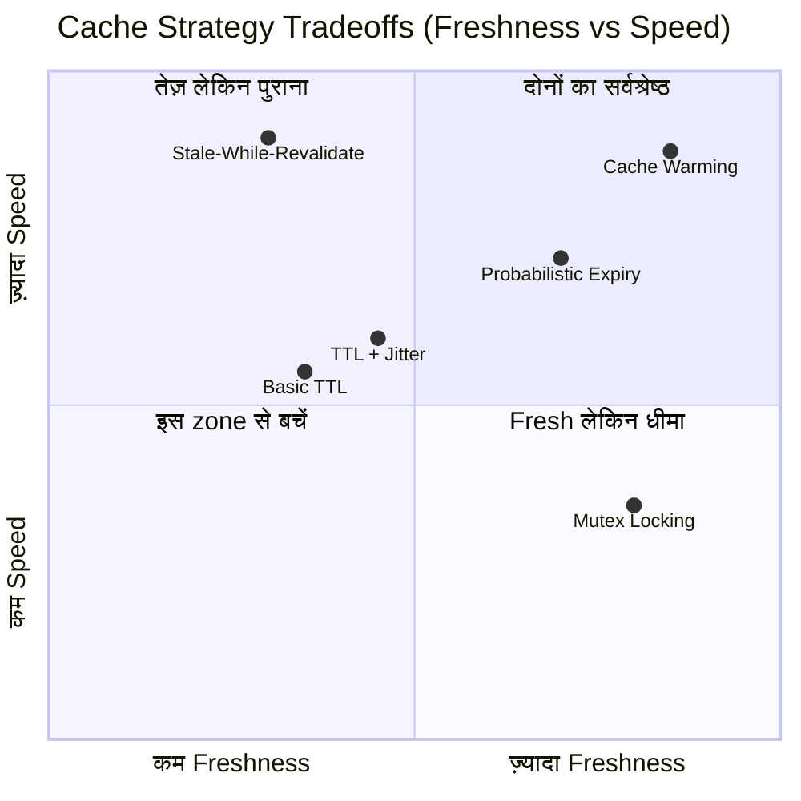
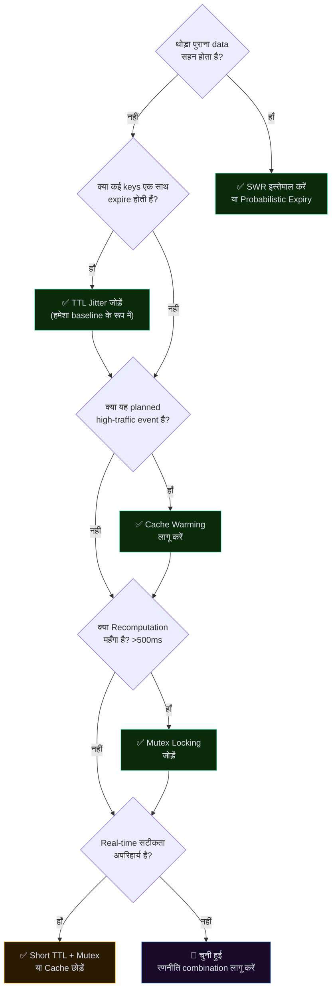

# जब Cache झूठ बोलता है, तो सब कुछ जल जाता है 🔥
### वितरित प्रणालियों में उन्नत Cache रणनीतियाँ

> *"Cache कोई सुरक्षा जाल नहीं है। सही रणनीति के बिना, यह एक टिक-टिक करता टाइम बम है।"*

---

## 🗺️ ब्लॉग Mind Map

```markmap
# वितरित प्रणालियों में Cache रणनीतियाँ

## बुनियादी TTL कहाँ कमज़ोर पड़ता है
- Synchronized Expiry
  - सभी keys एक ही TTL से set → एक साथ expire
  - बड़े पैमाने पर cache-miss
- Cold Start समस्या
  - Cache restart = शून्य data
  - सभी requests सीधे DB पर
- Last Mile Lag
  - Expiry से पहले पुराना data serve होता है
  - बाद में महँगी recomputation

## Thundering Herd
- मूल कारण: Temporal Correlation
- सभी clients एक साथ expiry देखते हैं
- DB पर queries की बाढ़
- Cascading failure का खतरा
- वास्तविक उदाहरण
  - IPL Live Score (Hotstar)
  - Netflix आधी रात release
  - Flipkart Big Billion Days

## रणनीति १: TTL Jitter
- TTL में random offset जोड़ना
- Expiry समय फैलाता है
- Full Jitter बनाम Equal Jitter
- AWS ने Full Jitter सुझाया
- Synchronized Thundering Herd खत्म होता है

## रणनीति २: Probabilistic Early Expiration
- XFetch Algorithm
- Expiry नज़दीक आने पर refresh probability बढ़ती है
- Hard expiry से पहले background recompute
- β आक्रामकता नियंत्रित करता है
- धीमे-compute होने वाले data के लिए आदर्श

## रणनीति ३: Mutex / Cache Locking
- सिर्फ १ request recompute करती है
- बाकी wait करते हैं → fresh cache का फायदा उठाते हैं
- Redis के ज़रिए Distributed Mutex (Redlock)
- Wait करने वालों की latency बढ़ती है
- Lock पर हमेशा TTL रखें

## रणनीति ४: Stale-While-Revalidate
- पुराना data तुरंत serve करें
- Background refresh trigger करें
- अगली request को fresh data मिलता है
- Cloudflare, Fastly, Akamai इस्तेमाल करते हैं
- Vercel SWR library
- वित्तीय / चिकित्सा data के लिए उचित नहीं

## रणनीति ५: Cache Warming
- Traffic spike से पहले pre-load करें
- प्रकार
  - Predictive Warming
  - Replay-Based Warming
  - Hot-Standby Warming
- Netflix CDN pre-warming
- Flipkart sale pre-loading
- IPL मैच की तैयारी

## Tradeoffs त्रिकोण
- Freshness बनाम Latency बनाम Consistency
- CAP Theorem की प्रतिध्वनि
- कोई एक रणनीति तीनों नहीं जीतती
- सहनशीलता के अनुसार चुनाव करें

## कहाँ क्या इस्तेमाल करें
- IPL Live Score → Jitter + Mutex
- E-commerce Sale → Warming + SWR
- Netflix Release → Warming + CDN SWR
- Bank Balance → Mutex + Short TTL
- Analytics Dashboard → SWR + Probabilistic
- Social Feed → SWR + Jitter
```

---

## भूमिका — वह रात जब Netflix ने लगभग Internet तोड़ दिया

रात के ११:५९ बज रहे हैं।  
दुनिया भर के लाखों दर्शक एक मशहूर वेब सीरीज़ का आखिरी एपिसोड देखने के लिए बेसब्री से इंतज़ार कर रहे हैं।  
घड़ी आधी रात दिखाती है।  
सब एक साथ **"Play"**  बटन दबाते हैं।  
Netflix का cache — जो पिछले एक घंटे से खुशी-खुशी data serve कर रहा था —  
अचानक expire हो जाता है। 
हर server ताजे data के लिए database की तरफ दौड़ता है।  
Database का दम घुटने लगता है।  
App धीमा हो जाता है।  
Twitter शिकायतों से भर जाता है।

इस घटना का एक नाम है।  
Engineers इसे **Thundering Herd Problem** कहते हैं।  
और नियादी TTL कैशिंग भी इस समस्या को पैदा करने में मदद करती है।

असल में, कैशिंग सुनने में आसान लगता है:  
किसी चीज़ को एक बार कंप्यूट करें,  
रिज़ल्ट को Time-To-Live (TTL) के साथ स्टोर करें,  
कैश से उसे जल्दी से सर्व करें,  
और जब वह एक्सपायर हो जाए तो उसे फिर से कंप्यूट करें।  
आसान। साफ़। सुंदर।

**जब तक ऐसा रहता है।**

वितरित प्रणालियों में —  
जहाँ हज़ारों users सैकड़ों servers पर एक साथ आते हैं —  
naive caching, caching न होने से भी ज़्यादा खतरनाक हो सकती है।  
यह blog आपको उन battle-tested रणनीतियों की गहराई में ले जाता है,  
जिन्हें Netflix, Amazon और Hotstar जैसी कंपनियाँ  
traffic spikes के दौरान अपनी प्रणालियों को ज़िंदा रखने के लिए इस्तेमाल करती हैं।

---

## १. बुनियादी TTL Caching पर्याप्त क्यों नहीं है

Caching, computing की सबसे पुरानी तरकीबों में से एक है।  
विचार सुंदर है:  
बार-बार वही चीज़ compute या fetch करने की बजाय,  
उसे किसी तेज़ जगह (जैसे RAM) में स्टोर करो और दोबारा इस्तेमाल करो।

TTL (Time-To-Live) cached data को अपने आप साफ़ करता है।  
आप एक timer सेट करते हैं — मान लीजिए ५ मिनट — और उसके बाद,  
data पुराना माना जाता है और हटा दिया जाता है।  
अगली request एक ताज़ा fetch trigger करती है।

> 🚀 **हैरान करने वाली बात:** RAM से data access करने में ~१०० nanoseconds लगते हैं। Network पर database से fetch करने में ~१० milliseconds लगते हैं। यह **१,००,००० गुना गति का अंतर** है। 

### बुनियादी TTL के तीन खामोश हत्यारे

| समस्या | क्या होता है | परिणाम |
|---|---|---|
| ⚡ Synchronized Expiry | एक ही समय पर set की गई सभी keys एक साथ expire होती हैं | DB पर बड़े पैमाने पर cache-miss की बाढ़ |
| 🧊 Cold Start समस्या | Cache restart = शून्य cached data | हर request origin पर जाती है |
| ⏳ Last Mile Lag | Expiry से पहले पुराना data serve होता है | बाद में महँगी recomputation spike |

> ⚠️ **कड़वा सच:** सामान्य traffic के दौरान आपकी रक्षा करने वाला cache, traffic spike के दौरान नुकसान को *बढ़ा* सकता है। production में naive TTL caching का यही विरोधाभास है।

> *"Cache कोई सुरक्षा जाल नहीं है। सही रणनीति के बिना, यह एक टिक-टिक करता टाइम बम है।"*

---

## २. Cache Expiry से Traffic Spike कैसे आता है — Thundering Herd

एक लोकप्रिय IPL मैच की कल्पना करें।  
Hotstar ने सभी ५ करोड़ दर्शकों के लिए live score cache किया है।  
TTL १० सेकंड पर set है।  
ठीक T=१० सेकंड पर,  
**सबके लिए** cache expire हो जाता है।  
सभी ५ करोड़ clients एक साथ database server को updated scores के लिए request भेजते हैं।

Database एक पल में ५ करोड़ queries की दीवार देखता है।  
यह इसके लिए बना नहीं था।  
यह घुटनों पर गिर जाता है।  
**Thundering Herd** में आपका स्वागत है।

Thundering Herd समस्या तब उत्पन्न होती है  
जब साझा cache expiry के बाद  
बड़ी संख्या में processes या requests एक साथ trigger होती हैं।  
वितरित प्रणालियों में, यह पूरे database clusters को गिरा सकती है।

### आरेख — Thundering Herd प्रवाह



> 📊 **वास्तविक संख्याएँ:** Amazon Prime Day 2023 के दौरान, Amazon ने ४८ घंटों में **३७.५ करोड़ से अधिक वस्तुओं की बिक्री** संभाली। बुद्धिमान caching के बिना, प्रति request केवल ०.०१ सेकंड की देरी भी अरबों डॉलर के राजस्व नुकसान में बदल जाएगी। Cache रणनीति सिर्फ developer की चिंता नहीं है — यह व्यापार के जीवित रहने का सवाल है।

मूल समस्या है **temporal correlation**:  
बहुत सारी cache entries एक ही expiry timestamp साझा करती हैं।  
यह किराने की दुकान की सभी दूध की थैलियों की expiry date एक जैसी होने जैसा है —  
जब वे सब एक साथ खराब होती हैं,  
तो कितनी भी restocking काम नहीं आती।

> *"Thundering Herd दरवाज़ा नहीं खटखटाता। वह दरवाज़ा तोड़कर अंदर आता है। Cache expire होते ही, आपका database emergency room बन जाता है।"*

---

## ३. TTL Jitter — Expiration में Randomness जोड़ना

Synchronized expiry का इलाज बेहद सरल है:  
**सब कुछ एक साथ expire न होने दें।**

हर cache entry को ठीक ३०० सेकंड का TTL सेट करने की बजाय,  
एक random offset — यानी "jitter" — जोड़ें:

```
TTL = base_ttl + random(-30, +30)
```

तो T=३०० पर expire होने वाली १०,००० keys की जगह,  
वे अब T=२७० और T=३३० के बीच expire होती हैं।  
आपके database को एक विनाशकारी spike की बजाय refresh requests का एक सुचारु, प्रबंधनीय प्रवाह मिलता है।

### आरेख — Synchronized बनाम Jittered TTL

```mermaid
gantt
    title Synchronized TTL vs Jittered TTL Expiry Timeline
    dateFormat X
    axisFormat %ss

    section ❌ Jitter के बिना
    Key-1 (cache active)   :active,    0, 300
    Key-2 (cache active)   :active,    0, 300
    Key-3 (cache active)   :active,    0, 300
    Key-4 (cache active)   :active,    0, 300
    DB SPIKE 💥            :crit,    300, 315

    section ✅ Jitter के साथ
    Key-1 (active)         :active,  0, 272
    Key-2 (active)         :active,  0, 288
    Key-3 (active)         :active,  0, 306
    Key-4 (active)         :active,  0, 321
    सुचारु Refreshes        :         272, 330
```



### Full Jitter बनाम Equal Jitter

AWS ने अपने प्रसिद्ध blog post *"Exponential Backoff And Jitter"* [१] में cache TTLs के लिए **Full Jitter** की सिफारिश की —  
जहाँ expiry का समय एक range में पूरी तरह randomize किया जाता है।  
इससे backend services पर contention नाटकीय रूप से कम होती है।

> 🧠 **अवधारणा अंतर्दृष्टि:** यही "jitter" सिद्धांत network retry logic में इस्तेमाल होता है। जब Wi-Fi routers collision के बाद दोबारा transmit करने की कोशिश करते हैं, तो वे random backoff timers (CSMA/CD) इस्तेमाल करते हैं — बिल्कुल TTL jitter जैसी ही बात। भौतिकी और वितरित प्रणालियाँ एक ही ज्ञान साझा करती हैं।

> *"Randomness का मतलब अराजकता नहीं है। वितरित प्रणालियों में, थोड़ी-सी randomness synchronized आपदा का इलाज है।"*

---

## ४. Probability-Based Early Expiration

Jitter synchronized expiry को हल कर देता है।  
लेकिन अभी भी एक समस्या है: जब कोई key expire होती है,  
तो अगली request **हमेशा** serve होने से पहले पूरी recomputation का इंतज़ार करती है।  
क्या हो अगर हम entry के वास्तव में expire होने से *पहले* ही recompute शुरू कर सकें?

यहाँ आता है **Probabilistic Early Expiration** —  
जिसे **XFetch algorithm** भी कहते हैं।

### मूल विचार

जैसे-जैसे cached value अपने TTL के नज़दीक आती है,  
वैसे-वैसे individual requests को background refresh trigger करने की बढ़ती *संभावना* दी जाती है।  
शुरुआती requests को कम संभावना होती है।  
Expiry के नज़दीक आने वाली requests को बहुत ज़्यादा संभावना होती है।

इसे एक जलती मोमबत्ती की तरह समझें।  
ज़्यादातर लोग कमरे की रोशनी इस्तेमाल करते रहते हैं।  
लेकिन जैसे-जैसे मोमबत्ती छोटी होती है,  
कोई *कमरा अँधेरा होने से पहले* ही नई मोमबत्ती लेने चला जाता है।

### आरेख — Probability-Based Early Expiration



> 🔬 **गणित (हल्के अंदाज़ में):** XFetch का सूत्र है: **recompute if `(now − expiry) > −β × δ × log(rand())`** — जहाँ β नियंत्रित करता है कि हम कितनी जल्दी refresh करें, और δ recomputation का समय है। Recomputation जितना ज़्यादा समय लेती है, algorithm उतनी जल्दी refresh शुरू करता है। सरल, सुंदर, शक्तिशाली।

> *"Cache के खाली होने का इंतज़ार मत करो। एक समझदार प्रणाली किसी को प्यास लगने से पहले ही कुएँ को भर देती है।"*

---

## ५. Mutex / Cache Locking — सिर्फ एक Request अंदर

१०० requests एक साथ आती हैं।  
Cache अभी-अभी expire हुआ।  
सभी १०० को cache miss दिखता है।  
सभी १०० database की तरफ दौड़ते हैं।  
Database वही महँगा query १०० बार चलाता है,  
वही result १०० बार लौटाता है,  
और सभी १०० responses cache में store किए जाते हैं —  
बिल्कुल वही value १०० बार लिखी जाती है।  
यह computational बर्बादी और database का दुरुपयोग एक साथ है।

समाधान: **सिर्फ एक request को महँगा काम करने दो।  
बाकी सब रुकें।**

एक **Mutex (Mutual Exclusion Lock)** कहता है:  
"एक समय में सिर्फ एक ही thread/request इस critical section में प्रवेश कर सकती है।"

### यह कैसे काम करता है

1. Request #1 को cache miss दिखता है → mutex lock प्राप्त करती है
2. Requests #2 0 को cache miss दिखता है → lock प्राप्त करने की कोशिश → **blocked, वे इंतज़ार करते हैं**
3. Request #1 DB से fresh data fetch करती है → cache populate करती है
4. Request #1 lock छोड़ती है
5. Requests #2 अब **cache से fresh data** पढ़ती हैं — cache hit! ✅

### आरेख — Mutex Cache Locking प्रवाह



### Redis के साथ Distributed Mutex

वितरित प्रणालियों में,  
सामान्य in-process mutex काम नहीं करता —  
Request #1 Server A पर हो सकती है,  
जबकि Request #2 Server B पर।  
आपको एक **distributed lock** चाहिए —  
आमतौर पर Redis के `SET key value NX PX timeout` command के ज़रिए (**Redlock algorithm**) लागू किया जाता है।

> ⚠️ **सावधान रहें:** Mutex, इंतज़ार करने वाली requests की latency बढ़ाता है। अगर lock धारक crash हो जाए, तो lock TTL आपको बचाता है। "Lock timeout" को gracefully संभालें — इंतज़ार करने वाली requests को कभी भूखा न रखें।

> *"जब सब एक ही काम के लिए दौड़ते हैं, तो कोई भी काम ठीक से नहीं होता। एक कामगार, एक काम, सबको फायदा।"*

---

## ६. Stale-While-Revalidate (SWR) — पुराना Serve करो, चुपचाप Refresh करो

Mutex users को इंतज़ार करवाता है।  
यह कभी-कभी अस्वीकार्य होता है।  
कई use cases के लिए एक बेहतर दर्शन है:

> *"User को तुरंत थोड़ा पुराना data दो। Background में refresh करो। अगली request को fresh data मिलेगा। किसी ने इंतज़ार नहीं किया।"*

**Stale-While-Revalidate (SWR)** "serving" और "refreshing" को अलग करता है।  
Expired data के लिए request आने पर:

1. **तुरंत पुरानी (stale) value लौटाएँ** — user के लिए शून्य latency
2. **साथ ही background refresh trigger करें**
3. **अगली request को fresh value मिलती है**

यह बिल्कुल वैसा ही है जैसे आधुनिक CDNs काम करते हैं।  
Cloudflare, Fastly और Akamai HTTP headers के ज़रिए SWR support करते हैं:

```
Cache-Control: max-age=300, stale-while-revalidate=60
```

### आरेख — Stale-While-Revalidate प्रवाह



> 🌍 **वास्तविक दुनिया में अपनाना:** SWR pattern इतना लोकप्रिय है कि Vercel ने अपनी मशहूर React data-fetching library का नाम इसी पर रखा — **SWR** — जिसे GitHub [२] पर 32.3k से अधिक stars मिले हैं। यह pattern Netflix, Twitter/X और दुनिया के लगभग हर बड़े CDN द्वारा इस्तेमाल किया जाता है।

### SWR सबसे अच्छा कहाँ काम करता है

| ✅ उचित | ❌ अनुचित |
|---|---|
| Leaderboards और scores | Bank balance |
| News feeds | Stock prices |
| Product listings | चिकित्सा अभिलेख |
| Analytics dashboards | Real-time inventory |
| Social media feeds | Payment data |

> *"Users को तुरंत परफेक्ट data नहीं चाहिए। उन्हें तुरंत data चाहिए। परफेक्शन background में आ सकता है।"*

---

## ७. Cache Warming / Pre-Warming — बाढ़ से पहले भरो

एक बड़े e-commerce sale की सुबह —  
Flipkart Big Billion Days की कल्पना करें।  
Engineers को पता है कि रात १२:०० बजे लाखों users platform पर आएँगे।  
अगर cache cold (खाली) है,  
तो वे पहली requests database पर पूरी ताकत से टकराएँगी।  
पहले १० मिनट विनाशकारी हो सकते हैं।

समाधान? **Users का cache warm करने का इंतज़ार मत करो।  
खुद warm करो।**

**Cache Warming** (Pre-Warming या Cache Priming भी कहते हैं)  
ये वह अभ्यास है जिसमें traffic आने से *पहले* ही बार-बार access होने वाले data को cache में proactively लोड किया जाता है।

### तीन Warming तरीके

| तरीका | कैसे काम करता है | किसके लिए सबसे अच्छा |
|---|---|---|
| 📋 **Predictive Warming** | ऐतिहासिक patterns के आधार पर data pre-load करें | Scheduled launches, sales, sports |
| 🔁 **Replay-Based Warming** | कल के traffic logs को नए cache पर replay करें | नया cache node deployment |
| 🤝 **Hot-Standby Warming** | Cutover से पहले नए node को live traffic shadow करें | Rolling cache cluster upgrades |

### आरेख — Sale से पहले Cache Warming Timeline



> 🎬 **Netflix Case Study:** जब Netflix आधी रात को नया season release करता है, तो वे **release से घंटों पहले** दुनिया भर में CDN caches pre-warm करते हैं। Video chunks, thumbnail images, metadata — surge आने से पहले ही edge nodes पर push किए जाते हैं। इसीलिए Netflix releases launch की रात शायद ही कभी अटकती हैं, करोड़ों simultaneous viewers के बावजूद।

> *"दमकल वाला इमारत के जलने पर नली नहीं भरता। Traffic आने से पहले अपना cache भरो।"*

---

## ८. शाश्वत त्रिकोण: Freshness बनाम Latency बनाम Consistency

हर caching रणनीति तीन ताकतों के बीच एक बातचीत है जो हमेशा तनाव में रहती हैं:

- **🕐 Freshness** — Data कितना ताज़ा है? कम TTL = ताज़ा data लेकिन ज़्यादा backend दबाव।
- **⚡ Latency** — Response कितनी तेज़ है? ज़्यादा caching = कम latency लेकिन संभावित staleness।
- **🔒 Consistency** — क्या सभी users को एक ही data दिखता है? Distributed caches सावधानी से manage न किए जाएँ तो अलग-अलग versions serve कर सकते हैं।

आप तीनों को एक साथ पूरी तरह optimize नहीं कर सकते। हर रणनीति अपनी प्राथमिकता चुनती है:

### आरेख — Strategy Tradeoff तुलना



### पूरी तुलना तालिका

| रणनीति | Freshness | Latency | Consistency | जटिलता |
|---|---|---|---|---|
| Basic TTL | 🟡 मध्यम | 🟢 उच्च | 🔴 कम | 🟢 सरल |
| TTL + Jitter | 🟡 मध्यम | 🟢 उच्च | 🟡 मध्यम | 🟢 सरल |
| Probabilistic Early Exp. | 🟢 उच्च | 🟢 उच्च | 🟡 मध्यम | 🟡 मध्यम |
| Mutex Locking | 🟢 उच्च | 🟡 मध्यम | 🟢 उच्च | 🟡 मध्यम-उच्च |
| Stale-While-Revalidate | 🔴 कम-मध्यम | 🟢 बहुत उच्च | 🔴 कम | 🟡 मध्यम |
| Cache Warming | 🟢 उच्च | 🟢 बहुत उच्च | 🟢 उच्च | 🔴 उच्च |

> 📐 **CAP Theorem की प्रतिध्वनि:** यह tradeoffs त्रिकोण वितरित प्रणालियों के प्रसिद्ध **CAP Theorem** की प्रतिध्वनि है  
> (Consistency, Availability, Partition Tolerance — सिर्फ २ चुनें)।  
Caching का अपना संस्करण है: Freshness, Latency, Consistency — और कोई एक रणनीति तीनों नहीं जीतती।

---

## ९. कौन सी रणनीति कब इस्तेमाल करें

### Mind Map — निर्णय मार्गदर्शिका

```markmap
# कौन सी Cache रणनीति?

## थोड़ा पुराना data सहन होता है?
### हाँ → SWR पर विचार करें
- Leaderboards
- News feeds
- Social media
- Analytics dashboards
### हाँ → Probabilistic Expiry पर भी विचार करें
- धीमे-compute होने वाला data
- ML model results
- Complex aggregations
### नहीं → हमेशा fresh data चाहिए
- आगे जाएँ: क्या कई keys एक साथ expire होती हैं?

## क्या कई keys एक साथ expire होती हैं?
### हाँ → हमेशा TTL Jitter जोड़ें
- सभी रणनीतियों के लिए baseline के रूप में लागू
- Full Jitter, Equal Jitter से बेहतर
### नहीं → एक ही hot key
- अकेले Mutex Locking इस्तेमाल करें

## क्या यह planned high-traffic event है?
### हाँ → Cache Warming अनिवार्य
- Flipkart Big Billion Days
- IPL मैच शुरुआत
- Netflix Season Drop
- Product Launch
### नहीं → Organic warming पर निर्भर रहें

## क्या Recomputation महँगा है? (>500ms)
### हाँ → Mutex Locking जोड़ें
- Duplicate DB queries रोकता है
- Distributed systems के लिए Redis Redlock
### नहीं → Basic TTL + Jitter पर्याप्त

## क्या Real-time सटीकता अपरिहार्य है?
### हाँ → Short TTL + Mutex या cache छोड़ें
- Bank balances
- Stock trading
- चिकित्सा अभिलेख
- Live auctions
### नहीं → कोई भी रणनीति काम करेगी

## वास्तविक दुनिया की Mappings
### IPL Live Score → Jitter + Mutex
### E-commerce Sale → Warming + SWR
### Netflix Drop → Warming + CDN SWR
### Bank Balance → Mutex + Short TTL
### Analytics Board → SWR + Probabilistic
### Social Feed → SWR + Jitter
### New Cache Node → Replay Warming
```

---

### Quick Reference तालिका

| परिस्थिति | अनुशंसित रणनीति | क्यों |
|---|---|---|
| 🏏 **IPL Live Score** | TTL Jitter + Mutex | लाखों users एक ही key पर; expiry फैलाएँ + duplicate DB hits रोकें |
| 🛒 **E-commerce Flash Sale** | Cache Warming + SWR | Top products pre-load करें; थोड़ी पुरानी कीमतें स्वीकार्य हैं |
| 🎬 **Netflix नई Release** | Cache Warming + CDN SWR | घंटों पहले edges पर metadata push करें; updates के लिए background refresh |
| 🏦 **Bank Balance Query** | Mutex + Short TTL (या cache नहीं) | Consistency अपरिहार्य; staleness = compliance violation |
| 📊 **Analytics Dashboard** | SWR + Probabilistic Expiry | तेज़ response > freshness; धीमी aggregations के लिए proactive refresh |
| 🔄 **नया Cache Node** | Hot-Standby / Replay Warming | Live होने से पहले cold-start आपदा से बचें |
| 📱 **Social Media Feed** | SWR + Jitter | Content millisecond-fresh होने की ज़रूरत नहीं; load फैलाएँ; तेज़ serve करें |
| 🎮 **Game Leaderboard** | SWR + Probabilistic Expiry | Eventual consistency ठीक है; उच्च read volume को कम latency चाहिए |

---

### ५-सवालों का निर्णय प्रवाह



> *कोई एक सार्वभौमिक सर्वश्रेष्ठ cache रणनीति नहीं है।  
सिर्फ आपके data की freshness ज़रूरतों के लिए, आपके users की latency सहनशीलता के लिए,  
और आपके database की दर्द सहने की क्षमता के लिए सही रणनीति होती है।*

---

## निष्कर्ष — Cache समझदारी से इस्तेमाल करो या पछताओ

हमने Netflix की एक कहानी से शुरुआत की और एक निर्णय framework पर समाप्त किया।  
बीच का सफर distributed systems engineering के असली युद्ध-ज़ख्मों की एक सैर था।

### पूरी रणनीति Mind Map

```markmap
# Cache रणनीतियाँ — अंतिम सारांश

## 🔴 समस्या
- Basic TTL Thundering Herd बनाता है
- Synchronized expiry = DB पर बाढ़
- Cold start = launch पर शून्य सुरक्षा

## 🟡 रणनीति १: TTL Jitter
- Expiry randomly फैलाएँ
- TTL = base + random(-30s, +30s)
- Full Jitter बेहतर है
- ✅ Production में हमेशा baseline के रूप में इस्तेमाल करें

## 🟡 रणनीति २: Probabilistic Early Expiration
- XFetch algorithm
- TTL नज़दीक आने पर refresh की संभावना बढ़ती है
- Hard expiry से पहले background refresh
- ✅ धीमे-compute, high-read data के लिए इस्तेमाल करें

## 🟡 रणनीति ३: Mutex Locking
- Miss पर सिर्फ १ request recompute करती है
- बाकी wait करते हैं → fresh cache पढ़ते हैं
- Distributed systems के लिए Redis Redlock
- ✅ Recomputation महँगा होने पर इस्तेमाल करें

## 🟡 रणनीति ४: Stale-While-Revalidate
- Stale तुरंत serve → async refresh
- CDN native support
- Cache-Control: stale-while-revalidate
- ✅ थोड़ी staleness स्वीकार्य होने पर इस्तेमाल करें

## 🟡 रणनीति ५: Cache Warming
- Traffic आने से पहले pre-load करें
- Predictive / Replay / Hot-Standby
- Netflix, Flipkart, IPL इस्तेमाल करते हैं
- ✅ Planned traffic spikes के लिए अनिवार्य

## 🟢 सुनहरे नियम
- Production में हमेशा jitter जोड़ें
- हर बड़े launch से पहले warm करें
- Staleness tolerance को data type से मिलाएँ
- महँगी recomputation के लिए mutex इस्तेमाल करें
- असली systems के लिए रणनीतियाँ मिलाएँ
- Hit rate, miss rate, latency monitor करें

## 🌟 अंतिम अंतर्दृष्टि
- Stack Overflow १ server पर चलता है
- Strategy हमेशा hardware को पीछे छोड़ती है
- सबसे अच्छा cache वह है जो users को कभी महसूस नहीं होता
```

### हमने क्या सीखा

| रणनीति | एक पंक्ति में सारांश |
|---|---|
| 🎯 TTL Jitter | Expiry समय randomly फैलाएँ। Production में हमेशा इस्तेमाल करें। |
| 🔮 Probabilistic Expiry | TTL नज़दीक आने पर proactively refresh करें। Last-mile spikes रोकें। |
| 🔐 Mutex Locking | एक request recompute, सबको फायदा। Duplicate DB काम रोकें। |
| ♻️ Stale-While-Revalidate | पुराना तुरंत serve करें, background में refresh करें। शून्य user-perceived latency। |
| 🔥 Cache Warming | Traffic आने से पहले cache भरें। Planned spikes के लिए सबसे प्रभावशाली। |
| ⚖️ Tradeoffs | Freshness, Latency, Consistency — कोई एक रणनीति तीनों नहीं जीतती। समझदारी से चुनें। |

---

> 🌟 Stack Overflow — दुनिया की सबसे ज़्यादा विज़िट की जाने वाली developer websites में से एक — **९५% requests एक ही on-premise server से** handle करता है, मुख्यतः उत्कृष्ट caching की वजह से। इस बीच, बहुत कम traffic वाले कुछ startups ५० servers इस्तेमाल करते हैं और फिर भी संघर्ष करते हैं। **Strategy हमेशा hardware को पीछे छोड़ती है।**

---

> *Cache का मतलब data store करना नहीं है।  
इसका मतलब है — विफलता आने से पहले उसके लिए design करना।  
सबसे अच्छी cache रणनीति वह है जो आपके users को कभी महसूस नहीं होती — क्योंकि कुछ भी गलत नहीं हुआ।*

---

संदर्भ:  
१. [Vercel SWR](https://github.com/vercel/swr)  
२. [Exponential Backoff And Jitter](https://aws.amazon.com/blogs/architecture/exponential-backoff-and-jitter)  

---
