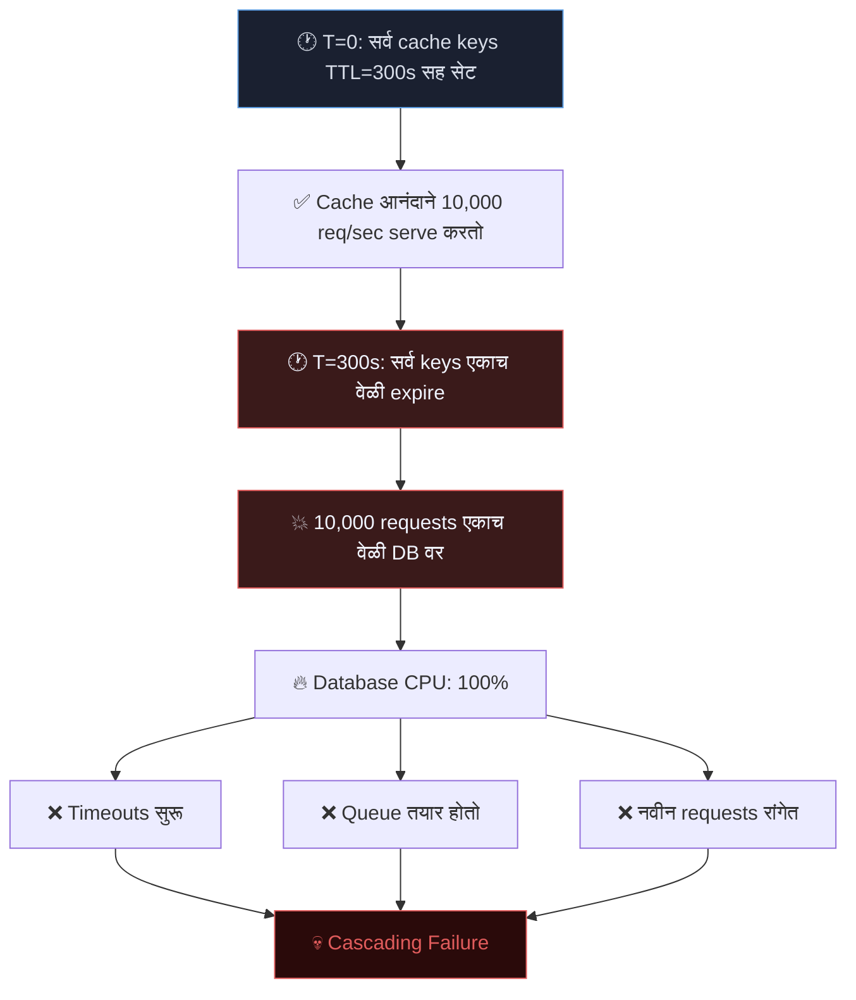
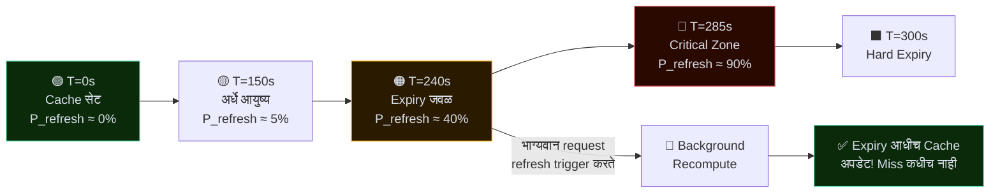
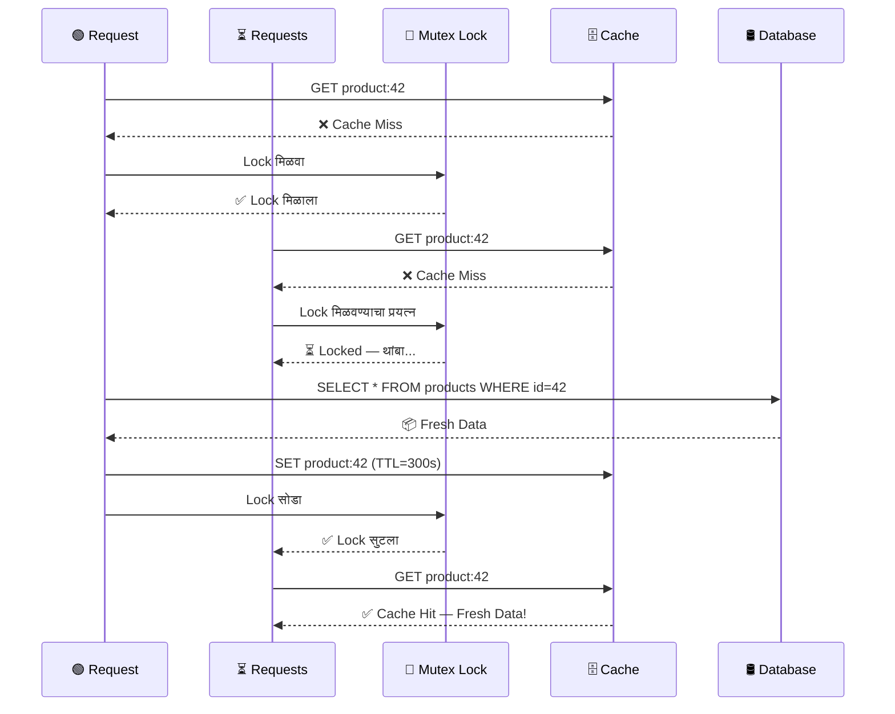
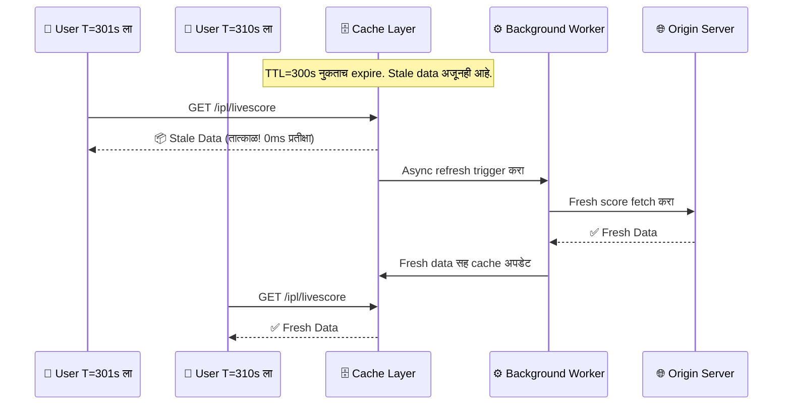
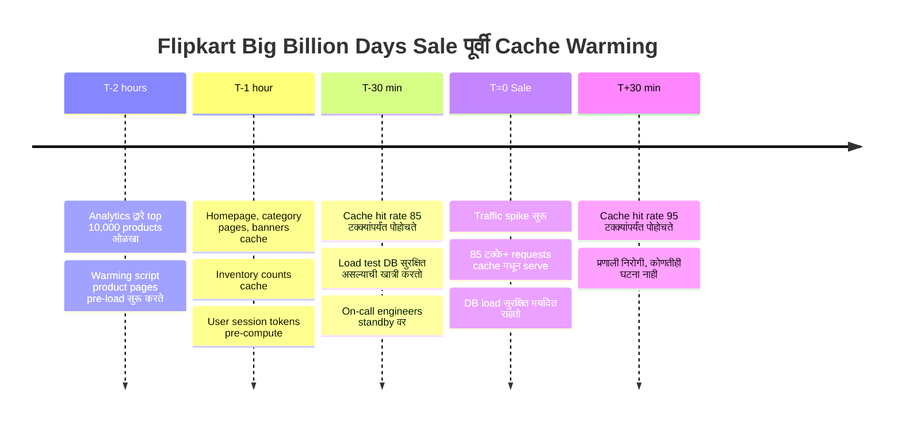
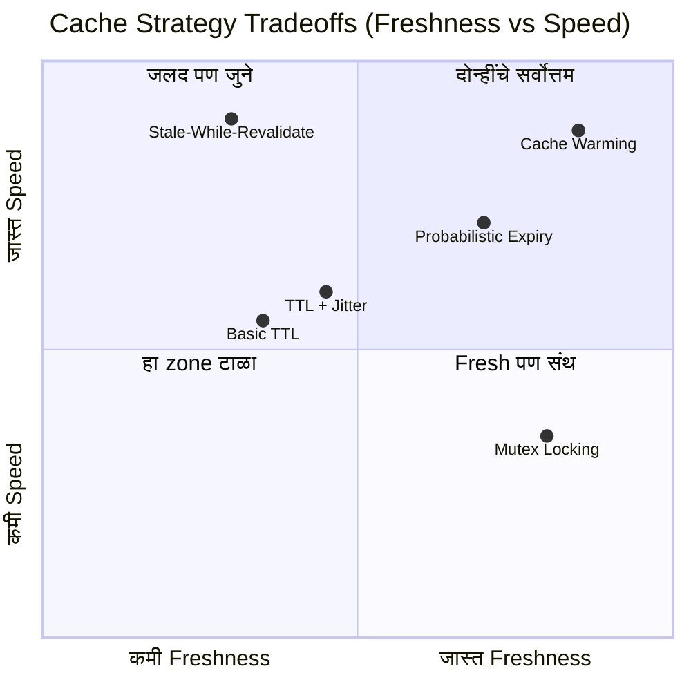
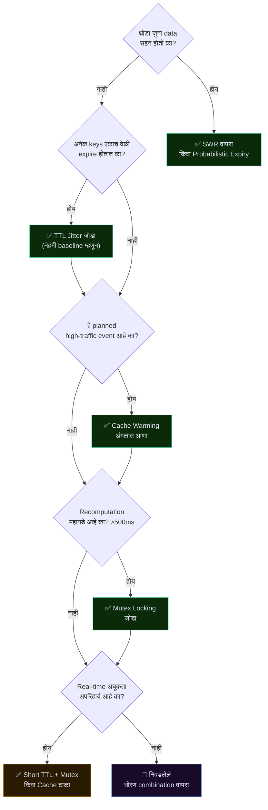

# कॅश खोटं बोलतो, तेव्हा सगळं जळून जातं
### वितरित प्रणालींमधील प्रगत कॅश धोरणे

> *"कॅश म्हणजे काही सुरक्षा जाळे नाही. योग्य धोरणाशिवाय, तो एक टिकटिक वाजणारा टाइम बॉम्ब आहे."*

---

## 🗺️ ब्लॉग माइंड मॅप

```markmap
---
title: वितरित प्रणालींमधील कॅश धोरणे
---

# वितरित प्रणालींमधील कॅश धोरणे

## मूळ TTL कुठे कमी पडतो
- सिंक्रोनाइज्ड एक्सपायरी
  - सर्व keys एकाच TTL ने सेट → एकत्र expire
  - मोठ्या प्रमाणात cache-miss
- कोल्ड स्टार्ट समस्या
  - Cache restart = शून्य data
  - सर्व requests थेट DB वर
- लास्ट माइल लॅग
  - Expiry आधी जुना data serve होतो
  - नंतर महागडी recomputation

## थंडरिंग हर्ड
- मूळ कारण: Temporal Correlation
- सर्व clients एकाच वेळी expiry बघतात
- DB वर queries चा महापूर
- Cascading failure चा धोका
- वास्तविक उदाहरणे
  - IPL लाइव्ह स्कोर (Hotstar)
  - Netflix मध्यरात्री release
  - Flipkart Big Billion Days

## धोरण १: TTL Jitter
- TTL मध्ये random offset जोडणे
  - `TTL = base + random(-30, +30)`
- Expiry वेळ पसरवते
- Full Jitter विरुद्ध Equal Jitter
- AWS ने Full Jitter सुचवले
- सिंक्रोनाइज्ड थंडरिंग हर्ड संपतो

## धोरण २: Probabilistic Early Expiration
- XFetch अल्गोरिदम
- Expiry जवळ आल्यावर refresh probability वाढते
- Hard expiry आधी background recompute
- β आक्रमकता नियंत्रित करतो
- हळू-compute होणाऱ्या data साठी आदर्श

## धोरण ३: Mutex / Cache Locking
- फक्त १ request recompute करते
- इतर wait करतात → fresh cache चा फायदा घेतात
- Redis द्वारे Distributed Mutex (Redlock)
  - `SET key value NX PX timeout`
- Wait करणाऱ्यांना latency वाढते
- Lock वर नेहमी TTL ठेवा

## धोरण ४: Stale-While-Revalidate
- जुना data तात्काळ serve करा
- Background refresh trigger करा
- पुढील request ला fresh data मिळतो
- Cloudflare, Fastly, Akamai वापरतात
  - `Cache-Control: max-age=300, stale-while-revalidate=60`
- Vercel SWR library
- आर्थिक / वैद्यकीय data साठी योग्य नाही

## धोरण ५: Cache Warming
- Traffic spike आधी pre-load करा
- प्रकार
  - Predictive Warming
  - Replay-Based Warming
  - Hot-Standby Warming
- Netflix CDN pre-warming
- Flipkart sale pre-loading
- IPL सामन्याची तयारी

## Tradeoffs त्रिकोण
- Freshness विरुद्ध Latency विरुद्ध Consistency
- CAP Theorem ची प्रतिध्वनी
- कोणतेही एक धोरण तिन्ही जिंकत नाही
- सहनशीलतेनुसार निवड करा

## कुठे काय वापरायचे
- IPL लाइव्ह स्कोर → Jitter + Mutex
- E-commerce Sale → Warming + SWR
- Netflix Release → Warming + CDN SWR
- Bank Balance → Mutex + Short TTL
- Analytics Dashboard → SWR + Probabilistic
- Social Feed → SWR + Jitter
```

---

## प्रस्तावना — त्या रात्री Netflix जवळजवळ इंटरनेट तोडणार होते

रात्रीचे ११:५९ वाजले आहेत. जगभरातील लाखो प्रेक्षक एका लोकप्रिय मालिकेचा शेवटचा भाग बघण्यासाठी आतुरतेने वाट पाहत आहेत. घड्याळ मध्यरात्र दाखवते. सर्वजण एकाच वेळी **"Play"** दाबतात. Netflix चा कॅश — जो गेल्या एक तासापासून आनंदाने data serve करत होता — अचानक expire होतो. प्रत्येक server ताज्या data साठी database कडे धाव घेतो. Database गुदमरतो. App मंदावतो. Twitter तक्रारींनी भरून जातो.

या प्रकाराला एक नाव आहे. इंजिनिअर्स याला **Thundering Herd Problem** म्हणतात. आणि मूळ TTL caching हा त्याचा साथीदार आहे.

आपण सर्वांनी caching ची मूलभूत गोष्ट शिकलो आहोत: महागडी computation किंवा fetch वारंवार करण्याऐवजी, ती कुठेतरी जलद ठिकाणी (जसे RAM मध्ये) साठवा आणि पुन्हा वापरा. Time-To-Live (TTL) सेट करा, cache मधून serve करा, आणि expire होऊ द्या. सोपे. स्वच्छ. सुंदर.

**जोपर्यंत ते तसे राहते.**

वितरित प्रणालींमध्ये — जिथे हजारो users शेकडो servers वर एकत्र येतात — naive caching, caching नसण्यापेक्षा जास्त धोकादायक ठरू शकते. हा ब्लॉग तुम्हाला त्या battle-tested धोरणांमध्ये घेऊन जातो, ज्या Netflix, Amazon आणि Hotstar सारख्या कंपन्या traffic spikes दरम्यान त्यांच्या प्रणाली जिवंत ठेवण्यासाठी वापरतात.

---

## १. मूळ TTL Caching पुरेसे का नाही

Caching म्हणजे संगणकशास्त्रातील सर्वात जुन्या युक्त्यांपैकी एक. कल्पना सुंदर आहे: वारंवार तीच गोष्ट compute किंवा fetch करण्याऐवजी, ती कुठेतरी जलद ठिकाणी (जसे RAM) साठवा आणि पुन्हा वापरा.

TTL (Time-To-Live) cached data ला स्वयंचलितपणे स्वच्छ करतो. तुम्ही एक timer सेट करता — समजा ५ मिनिटे — आणि त्यानंतर data जुना मानला जातो व काढून टाकला जातो. पुढील request ताजी fetch trigger करते.

> 🚀 **अचंबित करणारी गोष्ट:** RAM मधून data access करायला ~१०० nanoseconds लागतात. Network वरून database मधून fetch करायला ~१० milliseconds लागतात. हा **१,००,००० पट वेगाचा फरक** आहे. एक cache hit, प्रकाश ३ किलोमीटर प्रवास करायला लागणारा वेळ वाचवू शकतो!

### मूळ TTL चे तीन शांत हत्यारे

| समस्या | काय होते | परिणाम |
|---|---|---|
| ⚡ Synchronized Expiry | एकाच वेळी सेट केलेल्या सर्व keys एकत्र expire होतात | DB वर मोठ्या प्रमाणात cache-miss पूर |
| 🧊 Cold Start समस्या | Cache restart = शून्य cached data | प्रत्येक request origin ला जाते |
| ⏳ Last Mile Lag | Expiry आधी जुना data serve होतो | नंतर महागडी recomputation spike |

> ⚠️ **कठोर सत्य:** सामान्य traffic दरम्यान तुमचे रक्षण करणारा cache, traffic spike दरम्यान नुकसान *वाढवू* शकतो. उत्पादनातील naive TTL caching चा हाच विरोधाभास आहे.

> *"कॅश म्हणजे सुरक्षा जाळे नाही. योग्य धोरणाशिवाय, ते एक टिकटिक वाजणारा टाइम बॉम्ब आहे."*

---

## २. Cache Expiry मुळे Traffic Spike कसा येतो — थंडरिंग हर्ड

एक लोकप्रिय IPL सामना कल्पना करा. Hotstar ने सर्व ५ कोटी प्रेक्षकांसाठी live score cache केला आहे. TTL १० सेकंदांवर सेट आहे. बरोबर T=१० सेकंदांनी, **सर्वांसाठी** cache expire होतो. सर्व ५ कोटी clients एकाच वेळी database server ला updated scores साठी request पाठवतात.

Database एका क्षणात ५ कोटी queries ची भिंत बघतो. तो यासाठी तयार नव्हता. तो गुडघ्यांवर पडतो. **थंडरिंग हर्ड** मध्ये आपले स्वागत आहे.

थंडरिंग हर्ड समस्या तेव्हा उद्भवते जेव्हा सामायिक cache expiry नंतर मोठ्या संख्येने processes किंवा requests एकत्रितपणे trigger होतात. वितरित प्रणालींमध्ये, यामुळे संपूर्ण database clusters पडू शकतात.

### आकृती — थंडरिंग हर्ड प्रवाह



> 📊 **वास्तविक आकडे:** Amazon Prime Day 2023 दरम्यान, Amazon ने ४८ तासांत **३७.५ कोटींहून अधिक वस्तूंची विक्री** हाताळली. बुद्धिमान caching शिवाय, प्रति request ०.०१ सेकंदाचाही विलंब अब्जावधी डॉलर्सच्या महसूल नुकसानात cascade होईल. Cache धोरण हे फक्त developer ची चिंता नाही — ते व्यवसाय टिकण्याची बाब आहे.

मूळ समस्या म्हणजे **temporal correlation**: खूप जास्त cache entries एकाच expiry timestamp सामायिक करतात. हे किराणा दुकानातील सर्व दूधाच्या पिशव्यांची expiry date एकच असण्यासारखे आहे — जेव्हा त्या एकत्र खराब होतात, तेव्हा कितीही restocking केले तरी पुरत नाही.

> *"थंडरिंग हर्ड दरवाजावर ठोठावत नाही. तो दरवाजा तोडून आत येतो. Cache expire होण्याच्या क्षणी, तुमचा database आपत्कालीन कक्ष बनतो."*

---

## ३. TTL Jitter — Expiration मध्ये Randomness जोडणे

Synchronized expiry वरील उपाय अत्यंत सुंदर सोपा आहे: **सर्व गोष्टी एकाच वेळी expire होऊ देऊ नका.**

प्रत्येक cache entry ला बरोबर ३०० सेकंदांचा TTL सेट करण्याऐवजी, एक random offset — म्हणजेच "jitter" — जोडा:

```
TTL = base_ttl + random(-30, +30)
```

त्यामुळे T=३०० ला expire होणाऱ्या १०,००० keys ऐवजी, त्या आता T=२७० ते T=३३० दरम्यान expire होतात. तुमच्या database ला एका विनाशकारी spike ऐवजी refresh requests चा एक सुरळीत, व्यवस्थापनीय प्रवाह मिळतो.

### आकृती — Synchronized विरुद्ध Jittered TTL

```mermaid
gantt
    title Synchronized TTL vs Jittered TTL Expiry Timeline
    dateFormat X
    axisFormat %ss

    section ❌ Jitter शिवाय
    Key-1 (cache active)   :done,    0, 300
    Key-2 (cache active)   :done,    0, 300
    Key-3 (cache active)   :done,    0, 300
    Key-4 (cache active)   :done,    0, 300
    DB SPIKE 💥            :crit,    300, 315

    section ✅ Jitter सह
    Key-1 (active)         :active,  0, 272
    Key-2 (active)         :active,  0, 288
    Key-3 (active)         :active,  0, 306
    Key-4 (active)         :active,  0, 321
    सुरळीत Refreshes       :         272, 330
```



### Full Jitter विरुद्ध Equal Jitter

AWS ने त्यांच्या प्रसिद्ध blog post *"Exponential Backoff And Jitter"* मध्ये cache TTLs साठी **Full Jitter** सुचवले — जिथे expiry वेळ एका range मध्ये पूर्णपणे randomize केली जाते. यामुळे backend services वरील contention नाटकीयरित्या कमी होते.

> 🧠 **संकल्पना अंतर्दृष्टी:** हीच "jitter" संकल्पना network retry logic मध्ये वापरली जाते. जेव्हा Wi-Fi routers एखाद्या collision नंतर पुन्हा transmit करण्याचा प्रयत्न करतात, तेव्हा ते random backoff timers (CSMA/CD) वापरतात — TTL jitter सारखीच कल्पना. भौतिकशास्त्र आणि वितरित प्रणाली एकच शहाणपण सामायिक करतात.

> *"Randomness म्हणजे अराजकता नाही. वितरित प्रणालींमध्ये, थोडी randomness ही synchronized आपत्तीवरील इलाज आहे."*

---

## ४. Probability-Based Early Expiration

Jitter synchronized expiry सोडवतो. पण अजून एक समस्या आहे: key expire झाल्यावर, पुढील request **नेहमीच** serve होण्यापूर्वी पूर्ण recomputation ची वाट बघते. जर आपण entry खरोखर expire होण्यापूर्वीच recompute सुरू करू शकलो तर?

**Probabilistic Early Expiration** — ज्याला **XFetch algorithm** असेही म्हणतात — इथेच येते.

### मूळ कल्पना

जसजसे cached value त्याच्या TTL जवळ येते, तसतसे वैयक्तिक requests ला background refresh trigger करण्याची वाढती *संभाव्यता* दिली जाते. लवकरच्या requests ला कमी शक्यता असते. Expiry जवळ येणाऱ्या requests ला खूप जास्त शक्यता असते.

हे एखाद्या जळत्या मेणबत्तीसारखे आहे. बहुतेक लोक खोलीचा प्रकाश वापरत राहतात. पण मेणबत्ती लहान होत जाताना, कोणीतरी *खोली अंधारात जाण्यापूर्वीच* नवीन मेणबत्ती आणायला जातो.

### आकृती — Probability-Based Early Expiration



> 🔬 **गणित (हलक्या स्वरूपात):** XFetch सूत्र आहे: **recompute if `(now − expiry) > −β × δ × log(rand())`** — जिथे β किती आक्रमकपणे लवकर refresh करायचे हे नियंत्रित करतो, आणि δ म्हणजे recomputation वेळ. Recomputation जितका जास्त वेळ घेतो, तितक्या लवकर algorithm refresh सुरू करतो. सोपे, सुंदर, शक्तिशाली.

> *"Cache रिकामे होण्याची वाट पाहू नका. एक शहाणी प्रणाली कोणाला तहान लागण्यापूर्वीच विहीर भरते."*

---

## ५. Mutex / Cache Locking — फक्त एकच Request आत

१०० requests एकाच वेळी येतात. Cache नुकताच expire झाला. सर्व १०० cache miss बघतात. सर्व १०० database कडे धाव घेतात. Database तीच महागडी query १०० वेळा चालवतो, तोच निकाल १०० वेळा परत करतो, आणि सर्व १०० responses cache मध्ये साठवले जातात — बरोबर तीच value १०० वेळा लिहिली जाते. हे computational बेकार आणि database चा दुरुपयोग एकत्र आहे.

उपाय: **फक्त एकाच request ला महागडे काम करू द्या. बाकी सर्वांनी थांबावे.**

एक **Mutex (Mutual Exclusion Lock)** म्हणतो: "फक्त एकाच thread/request ला एका वेळी या critical section मध्ये प्रवेश मिळू शकतो."

### हे कसे काम करते

1. Request #1 ला cache miss दिसतो → mutex lock मिळवतो
2. Requests #2–#100 ला cache miss दिसतो → lock मिळवण्याचा प्रयत्न → **blocked, ते वाट बघतात**
3. Request #1 DB मधून fresh data fetch करतो → cache populate करतो
4. Request #1 lock सोडतो
5. Requests #2–#100 आता **cache मधून fresh data** वाचतात — cache hit! ✅

### आकृती — Mutex Cache Locking प्रवाह



### Redis सह Distributed Mutex

वितरित प्रणालींमध्ये, सामान्य in-process mutex काम करत नाही — Request #1 Server A वर असू शकतो, तर Request #2 Server B वर. तुम्हाला **distributed lock** हवे — सामान्यतः Redis च्या `SET key value NX PX timeout` command द्वारे (**Redlock algorithm**).

> ⚠️ **सावध राहा:** Mutex, wait करणाऱ्या requests साठी latency वाढवतो. Lock धारक crash झाल्यास, lock TTL तुम्हाला वाचवतो. "Lock timeout" gracefully हाताळा — wait करणाऱ्या requests ला कधीही उपाशी ठेवू नका.

> *"जेव्हा सर्वजण एकाच कामासाठी धावतात, तेव्हा कोणतेही काम नीट होत नाही. एक कामगार, एक काम, सर्वांना फायदा."*

---

## ६. Stale-While-Revalidate (SWR) — जुने Serve करा, शांतपणे Refresh करा

Mutex वापरकर्त्यांना वाट बघायला लावतो. हे कधीकधी अस्वीकार्य असते. अनेक use cases साठी एक चांगली तत्त्वज्ञान आहे:

> *"वापरकर्त्याला तात्काळ थोडा जुना data द्या. Background मध्ये refresh करा. पुढील request ला fresh data मिळेल. कोणी वाट बघितली नाही."*

**Stale-While-Revalidate (SWR)** "serving" आणि "refreshing" वेगळे करते. Expired data साठी request आल्यावर:

1. **तात्काळ जुनी (stale) value परत करा** — वापरकर्त्यासाठी शून्य latency
2. **एकाच वेळी background refresh trigger करा**
3. **पुढील request ला fresh value मिळते**

आधुनिक CDNs नेमके असेच काम करतात. Cloudflare, Fastly आणि Akamai HTTP headers द्वारे SWR support करतात:

```
Cache-Control: max-age=300, stale-while-revalidate=60
```

### आकृती — Stale-While-Revalidate प्रवाह



> 🌍 **वास्तविक जगातील वापर:** SWR pattern इतका लोकप्रिय आहे की Vercel ने त्यांच्या प्रसिद्ध React data-fetching library चे नाव त्यावरून ठेवले — **SWR** — ज्याला GitHub वर २८,००० हून अधिक stars आहेत. हा pattern Netflix, Twitter/X आणि जगातील जवळजवळ प्रत्येक मोठ्या CDN द्वारे वापरला जातो.

### SWR सर्वोत्तम कुठे काम करतो

| ✅ योग्य | ❌ अयोग्य |
|---|---|
| Leaderboards आणि scores | Bank balance |
| News feeds | Stock prices |
| Product listings | वैद्यकीय नोंदी |
| Analytics dashboards | Real-time inventory |
| Social media feeds | Payment data |

> *"वापरकर्त्यांना तात्काळ परिपूर्ण data नको असतो. त्यांना तात्काळ data हवा असतो. परिपूर्णता background मध्ये येऊ शकते."*

---

## ७. Cache Warming / Pre-Warming — महापुरापूर्वी भरा

एका मोठ्या e-commerce sale च्या सकाळी — Flipkart Big Billion Days कल्पना करा. Engineers ला माहीत आहे की रात्री १२:०० वाजता लाखो वापरकर्ते platform वर येतील. Cache cold (रिकामा) असेल तर, ते पहिले requests database वर पूर्ण शक्तीने आदळतील. पहिले १० मिनिटे विनाशकारी ठरू शकतात.

उपाय? **वापरकर्त्यांची cache warm करण्याची वाट बघू नका. स्वतःच warm करा.**

**Cache Warming** (Pre-Warming किंवा Cache Priming असेही म्हणतात) म्हणजे traffic येण्यापूर्वीच *वारंवार access होणारा data cache मध्ये proactively* भरण्याची सराव.

### तीन Warming पद्धती

| पद्धत | कसे काम करते | कशासाठी सर्वोत्तम |
|---|---|---|
| 📋 **Predictive Warming** | ऐतिहासिक patterns आधारे data pre-load | Scheduled launches, sales, sports |
| 🔁 **Replay-Based Warming** | काल्याच्या traffic logs नवीन cache विरुद्ध replay करा | नवीन cache node deployment |
| 🤝 **Hot-Standby Warming** | Cutover आधी नवीन node ला live traffic shadow करा | Rolling cache cluster upgrades |

### आकृती — Sale पूर्वी Cache Warming Timeline



> 🎬 **Netflix Case Study:** Netflix नवीन season मध्यरात्री release करताना, ते **release च्या काही तास आधीच** जागतिक स्तरावर CDN caches pre-warm करतात. Video chunks, thumbnail images, metadata — surge येण्यापूर्वीच edge nodes वर push केले जातात. म्हणूनच Netflix releases launch च्या रात्री क्वचितच अडखळतात, लाखो simultaneous viewers असूनही.

> *"अग्निशामक दल इमारत जळत असताना नळी भरत नाही. Traffic येण्यापूर्वीच तुमचा cache भरा."*

---

## ८. शाश्वत त्रिकोण: Freshness विरुद्ध Latency विरुद्ध Consistency

प्रत्येक caching धोरण म्हणजे नेहमी तणावात असलेल्या तीन शक्तींमधील वाटाघाटी:

- **🕐 Freshness** — Data किती अलीकडचे आहे? कमी TTL = fresher data पण जास्त backend दबाव.
- **⚡ Latency** — Response किती जलद आहे? जास्त caching = कमी latency पण संभाव्य staleness.
- **🔒 Consistency** — सर्व वापरकर्त्यांना एकच data दिसतो का? Distributed caches काळजीपूर्वक manage न केल्यास वेगवेगळ्या versions serve करू शकतात.

तुम्ही तिन्ही एकत्र पूर्णपणे optimize करू शकत नाही. प्रत्येक धोरण आपली प्राथमिकता निवडते:

### आकृती — Strategy Tradeoff तुलना



### संपूर्ण तुलना तक्ता

| धोरण | Freshness | Latency | Consistency | जटिलता |
|---|---|---|---|---|
| Basic TTL | 🟡 मध्यम | 🟢 उच्च | 🔴 कमी | 🟢 सोपे |
| TTL + Jitter | 🟡 मध्यम | 🟢 उच्च | 🟡 मध्यम | 🟢 सोपे |
| Probabilistic Early Exp. | 🟢 उच्च | 🟢 उच्च | 🟡 मध्यम | 🟡 मध्यम |
| Mutex Locking | 🟢 उच्च | 🟡 मध्यम | 🟢 उच्च | 🟡 मध्यम-उच्च |
| Stale-While-Revalidate | 🔴 कमी-मध्यम | 🟢 अत्यंत उच्च | 🔴 कमी | 🟡 मध्यम |
| Cache Warming | 🟢 उच्च | 🟢 अत्यंत उच्च | 🟢 उच्च | 🔴 उच्च |

> 📐 **CAP Theorem ची प्रतिध्वनी:** हा tradeoffs त्रिकोण वितरित प्रणालींमधील प्रसिद्ध **CAP Theorem** ची प्रतिध्वनी आहे  
> (Consistency, Availability, Partition Tolerance — दोनच निवडा).  
Caching ची स्वतःची आवृत्ती आहे: Freshness, Latency, Consistency — आणि कोणतेही एक धोरण तिन्ही जिंकत नाही.

---

## ९. कुठले धोरण कधी वापरायचे

### माइंड मॅप — निर्णय मार्गदर्शक

```markmap
---
title: Cache Strategy Decision Guide
---

# कुठले Cache धोरण?

## थोडा जुना data सहन होतो का?
### होय → SWR विचार करा
- Leaderboards
- News feeds
- Social media
- Analytics dashboards
### होय → Probabilistic Expiry विचार करा
- हळू-compute होणारा data
- ML model results
- Complex aggregations
### नाही → नेहमीच fresh data हवा
- पुढे जा: अनेक keys एकत्र expire होतात का?

## अनेक keys एकाच वेळी expire होतात का?
### होय → नेहमी TTL Jitter जोडा
- सर्व धोरणांसाठी baseline म्हणून लागू
- Full Jitter, Equal Jitter पेक्षा श्रेयस्कर
### नाही → एकच hot key
- Mutex Locking एकट्याने वापरा

## हे एक planned high-traffic event आहे का?
### होय → Cache Warming अनिवार्य
- Flipkart Big Billion Days
- IPL सामना सुरुवात
- Netflix Season Drop
- Product Launch
### नाही → Organic warming वर अवलंब

## Recomputation महागडे आहे का? (>500ms)
### होय → Mutex Locking जोडा
- Duplicate DB queries प्रतिबंध करते
- Distributed systems साठी Redis Redlock
### नाही → Basic TTL + Jitter पुरेसे

## Real-time अचूकता अपरिहार्य आहे का?
### होय → Short TTL + Mutex किंवा cache टाळा
- Bank balances
- Stock trading
- वैद्यकीय नोंदी
- Live auctions
### नाही → कोणतेही धोरण चालेल

## वास्तविक जगातील Mappings
### IPL Live Score → Jitter + Mutex
### E-commerce Sale → Warming + SWR
### Netflix Drop → Warming + CDN SWR
### Bank Balance → Mutex + Short TTL
### Analytics Board → SWR + Probabilistic
### Social Feed → SWR + Jitter
### New Cache Node → Replay Warming
```

---

### Quick Reference तक्ता

| परिस्थिती | शिफारस केलेले धोरण | का |
|---|---|---|
| 🏏 **IPL Live Score** | TTL Jitter + Mutex | लाखो users एकाच key वर; expiry पसरवा + duplicate DB hits प्रतिबंध |
| 🛒 **E-commerce Flash Sale** | Cache Warming + SWR | Top products pre-load करा; किंचित stale prices स्वीकार्य |
| 🎬 **Netflix नवीन Release** | Cache Warming + CDN SWR | तास आधी edges वर metadata push; updates साठी background refresh |
| 🏦 **Bank Balance Query** | Mutex + Short TTL (किंवा cache नाही) | Consistency अपरिहार्य; staleness = compliance violation |
| 📊 **Analytics Dashboard** | SWR + Probabilistic Expiry | जलद response > freshness; हळू aggregations साठी proactive refresh |
| 🔄 **नवीन Cache Node** | Hot-Standby / Replay Warming | Live होण्यापूर्वी cold-start आपत्ती टाळा |
| 📱 **Social Media Feed** | SWR + Jitter | Content millisecond-fresh असणे गरजेचे नाही; load पसरवा; जलद serve करा |
| 🎮 **Game Leaderboard** | SWR + Probabilistic Expiry | Eventual consistency ठीक आहे; उच्च read volume ला कमी latency हवी |

---

### ५-प्रश्नांचा निर्णय प्रवाह



> *कोणतेही एक सार्वत्रिक सर्वोत्तम cache धोरण नाही.  
फक्त तुमच्या data च्या freshness गरजांसाठी, तुमच्या वापरकर्त्यांच्या latency सहनशीलतेसाठी,  
आणि तुमच्या database च्या वेदना सहन करण्याच्या क्षमतेसाठी योग्य धोरण असते.*

---

## निष्कर्ष — Cache हुशारीने वापरा किंवा पश्चाताप करा

आपण Netflix च्या एका कथेने सुरुवात केली आणि एका निर्णय framework ने संपवले.  
मधला प्रवास म्हणजे distributed systems engineering च्या खऱ्या युद्धजखमांमधून एक फेरफटका होता.

### संपूर्ण धोरण माइंड मॅप

```markmap
---
title: Cache Strategies — Final Summary
---

# Cache धोरणे — अंतिम सारांश

## 🔴 समस्या
- Basic TTL मुळे Thundering Herd होतो
- Synchronized expiry = DB वर महापूर
- Cold start = launch वेळी शून्य संरक्षण

## 🟡 धोरण १: TTL Jitter
- Expiry randomly पसरवा
- `TTL = base + random(-30s, +30s)`
- Full Jitter श्रेयस्कर
- ✅ Production मध्ये नेहमी baseline म्हणून वापरा

## 🟡 धोरण २: Probabilistic Early Expiration
- XFetch algorithm
- TTL जवळ येताना refresh ची संभाव्यता वाढते
- Hard expiry आधी background refresh
- ✅ हळू-compute, high-read data साठी वापरा

## 🟡 धोरण ३: Mutex Locking
- Miss वर फक्त १ request recompute करते
- इतर wait करतात → fresh cache वाचतात
- Distributed systems साठी Redis Redlock
- ✅ Recomputation महागडे असताना वापरा

## 🟡 धोरण ४: Stale-While-Revalidate
- Stale तात्काळ serve → async refresh
- CDN native support
- `Cache-Control: stale-while-revalidate`
- ✅ किंचित staleness स्वीकार्य असताना वापरा

## 🟡 धोरण ५: Cache Warming
- Traffic येण्यापूर्वी pre-load करा
- Predictive / Replay / Hot-Standby
- Netflix, Flipkart, IPL वापरतात
- ✅ Planned traffic spikes साठी अनिवार्य

## 🟢 सुवर्ण नियम
- Production मध्ये नेहमी jitter जोडा
- प्रत्येक मोठ्या launch आधी warm करा
- Staleness tolerance data type नुसार जुळवा
- महागड्या recomputation साठी mutex वापरा
- वास्तविक systems साठी धोरणे एकत्र करा
- Hit rate, miss rate, latency monitor करा

## 🌟 अंतिम अंतर्दृष्टी
- Stack Overflow १ server वर चालतो
- Strategy hardware ला नेहमी मागे टाकते
- सर्वोत्तम cache तो असतो जो वापरकर्त्यांना कधीच जाणवत नाही
```

### आपण काय शिकलो

| धोरण | एका ओळीत सारांश |
|---|---|
| 🎯 TTL Jitter | Expiry वेळा randomly पसरवा. Production मध्ये नेहमी वापरा. |
| 🔮 Probabilistic Expiry | TTL जवळ येताना proactively refresh करा. Last-mile spikes प्रतिबंध करा. |
| 🔐 Mutex Locking | एक request recompute, सर्वांना फायदा. Duplicate DB काम प्रतिबंध करा. |
| ♻️ Stale-While-Revalidate | जुने तात्काळ serve करा, background मध्ये refresh करा. शून्य user-perceived latency. |
| 🔥 Cache Warming | Traffic येण्यापूर्वी cache भरा. Planned spikes साठी सर्वाधिक परिणामकारक. |
| ⚖️ Tradeoffs | Freshness, Latency, Consistency — कोणतेही एक धोरण तिन्ही जिंकत नाही. हुशारीने निवडा. |

---

> 🌟 Stack Overflow — जगातील सर्वाधिक भेट दिल्या जाणाऱ्या developer websites पैकी एक — **९५% requests एकाच on-premise server वरून** handle करतो, मुख्यतः उत्कृष्ट caching मुळे. दरम्यान, खूपच कमी traffic असलेले काही startups ५० servers वापरतात आणि तरीही संघर्ष करतात. **Strategy नेहमी hardware ला मागे टाकते.**

---

> *Cache म्हणजे data साठवणे नाही.  
ते म्हणजे अपयश येण्यापूर्वीच त्यासाठी design करणे.  
सर्वोत्तम cache धोरण ते असते जे तुमच्या वापरकर्त्यांना कधीच जाणवत नाही — कारण काहीही चुकीचे झाले नाही.*

---
