# 🐃 Understanding the Thundering Herd Problem

**When Your System Becomes the Only Open Store in Town**

---

> **"One cache expiry. Millions of requests. Zero mercy."**

---

## 🏪 The Stampede Begins — A Real-World Analogy

Imagine a popular store in your city that opens at 9 AM.  
On a normal day, customers trickle in throughout the day.  
But today is **the day of a mega-sale**.  
The store was closed for maintenance the night before.  
And everyone in the city got the same notification at exactly 8:59 AM.

At 9:00 AM sharp — **5,000 people rush through the single entrance at the same time.**

The billing counter crashes.  
Shelves are emptied before stock can be replenished.  
Security guards are overwhelmed.  
The store manager has a breakdown.

This, dear developer, is **the Thundering Herd Problem** — played out in the world of servers and software.

---

## ⚡ What Is the Thundering Herd Problem?

The **Thundering Herd Problem** occurs when a **large number of processes or requests are simultaneously awakened or triggered**, all competing for the same shared resource — overwhelming the system.

In distributed systems, it typically happens when:

- A **cache expires** and hundreds of servers try to rebuild it at the same time
- A **backend server restarts** and all waiting clients reconnect at once
- A **scheduled job finishes** and thousands of idle workers wake up together

> 💡 **Interesting Fact:** The term "Thundering Herd" was originally used in operating systems — when multiple processes were waiting on the same socket `accept()` call and all got woken up simultaneously, even though only *one* could proceed. The rest? Just wasted CPU cycles.

---

## 🗺️ Where Does It Commonly Occur?

The thundering herd hides in plain sight across your architecture:

| Location | Trigger | Impact |
|---|---|---|
| **Cache Layer** | TTL (Time To Live) expiry | All servers hammer the database |
| **Database** | Connection pool exhausted | Queries queue and timeout |
| **Load Balancer** | Server restart / health check recovery | Burst of queued requests flood one node |
| **Message Queues** | Batch of messages released | Consumers compete and crash |
| **Microservices** | Service comes back online | All retry attempts hit at once |

> *TTL (Time To Live) is the time limit after which data stored in the cache automatically expires and gets removed. ⏳*

---

## 🏗️ The Classic Architecture: App → Cache → DB

Here's the normal flow in most web systems:

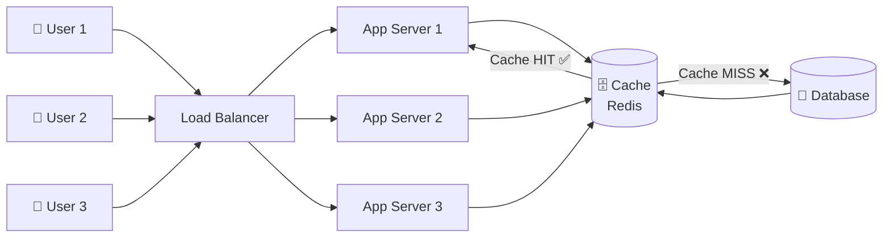

**When cache hits:** Fast response, database is at peace. 😌

**When cache misses:** A single server fetches from DB and stores in cache. Still manageable. 🤔

**When the cache EXPIRES for a hot key...** 🚨 *That's when the herd stampedes.*

> *A hot key is a data key that many users access repeatedly at the same time, causing high load on the system.*
> *During the IPL Final, the live_score cache key, which millions of people refresh at the same time — is an example of a hot key. 🔥*
---

## 🔥 The Real Drama: Cache Expiry Causing a Request Spike

Let's set the scene.  
It's **IPL Final night** 🏏.  
Your cricket score app is serving 500,000 users.  
You have product data cached in Redis with a **TTL of 60 seconds**.

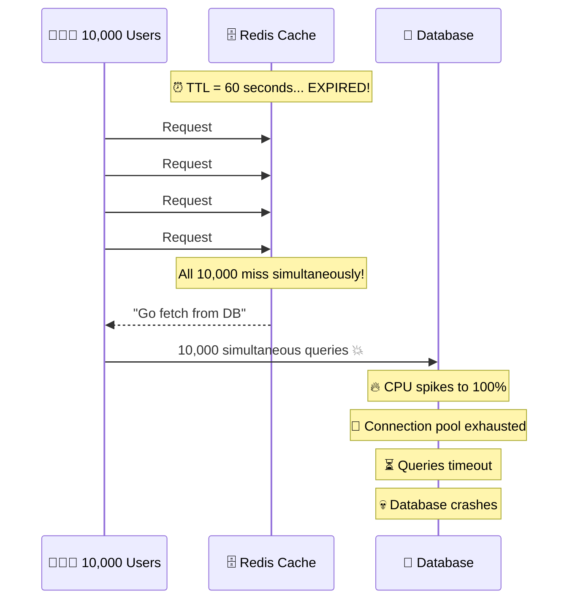

**One cache key expired. Ten thousand requests hit the database. The database says goodbye.**

> 🤯 **Amazement Alert:** During the **2023 Cricket World Cup**, several sports apps experienced exactly this. A single cache key for "live match scores" expired under load, causing a cascading database failure that took down the entire service for millions of users.

---

## 📊 Normal Spike vs. Thundering Herd — What's the Difference?

Not all traffic spikes are thundering herds. Here's how to tell them apart:

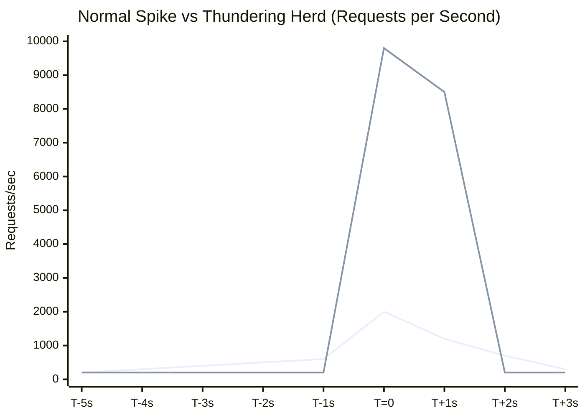

| Attribute | Normal Spike | Thundering Herd |
|---|---|---|
| **Shape** | Gradual rise & fall | Sudden vertical cliff |
| **Cause** | Real user activity | Synchronized system event |
| **Duration** | Minutes | Milliseconds to seconds |
| **Predictability** | Partially predictable | Often unpredictable |
| **Resource impact** | Manageable with scaling | Catastrophic even with resources |
| **Cache behavior** | Hits still work | All misses simultaneously |

> **Key Insight:** A thundering herd is not about *volume*. It's about **synchronization**. Even 1,000 requests become dangerous if they all arrive in the same 10 milliseconds.

---

## 🌐 Why It Becomes Dangerous in Distributed Systems

In a single-server world, thundering herds are painful. In **distributed systems**, they become catastrophic.

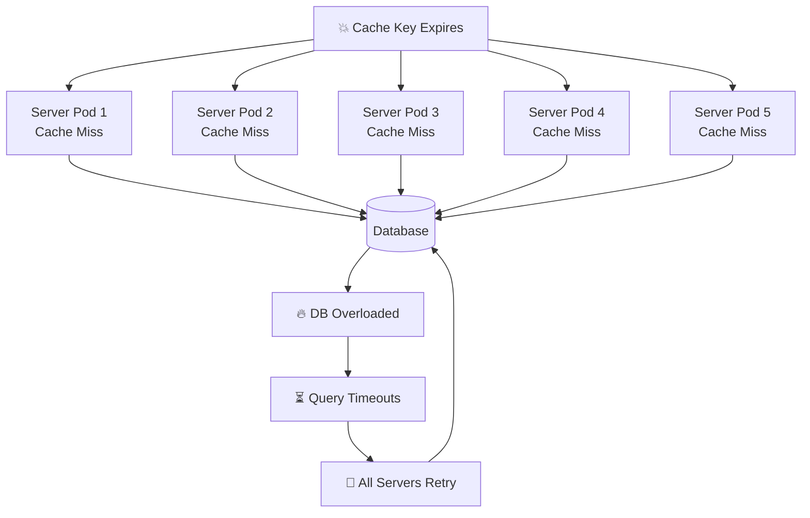

Notice what happens: **servers retry on failure**, which creates *another* thundering herd wave. This **cascading failure** is what takes down entire platforms.

> 💡 **Did You Know?** Amazon's early internal studies found that a mere **500ms increase in latency** caused a 1% drop in sales — and most of those latency spikes were caused by thundering herd events, not raw traffic volume.

---

## 💀 Impact on CPU, Database, Cache, and Latency

### 🖥️ Impact on CPU

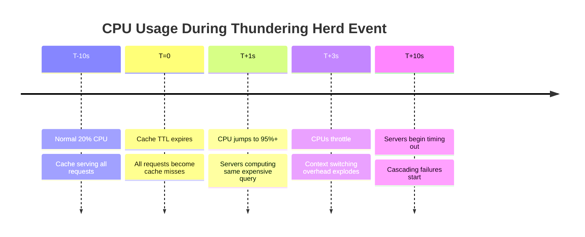

**What happens to CPU:**
- All app servers simultaneously run the same expensive computation
- Context switching overhead multiplies
- CPU cores are thrashed — doing duplicate work for the *same* result
- Ironically, all this work produces one answer that could have been computed once

### 💾 Impact on Database

The database is the **first victim**. When cache expires:

- Connection pool fills up instantly (typically 100-500 connections max)
- New connections queue — then timeout
- Slow queries pile up, blocking faster ones
- Locks are contested — deadlocks emerge
- The DB starts refusing connections entirely

> 🎯 **Interview Gem:** "The database doesn't care that all queries are identical. It executes each one. A thundering herd can execute the same SELECT query 10,000 times in 2 seconds."

### 🗄️ Impact on Cache

Paradoxically, the cache **suffers too**:

- Simultaneously writing the same key from 100 servers causes **write contention**
- Some servers may store **stale or partial data** as they race to write
- The "last writer wins" race can result in **cache inconsistency**
- High write throughput degrades cache read performance

### ⏱️ Impact on Latency

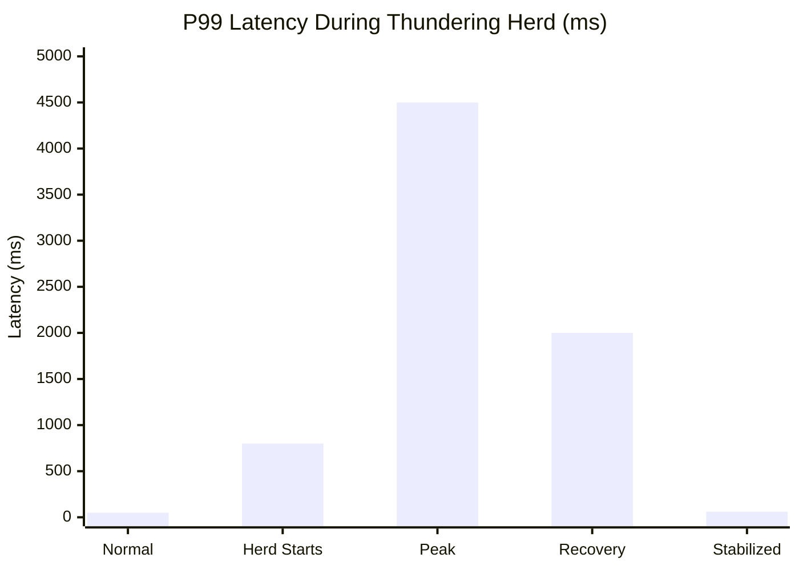

P99 latency can jump from **50ms to 4,500ms** in seconds. Users see:
- Spinning loaders
- "Something went wrong" errors
- App crashes on mobile
- Rage-quits (and social media complaints 😅)

---

## 🛡️ Techniques to Prevent or Reduce the Thundering Herd

Now the good news: this is a **solved problem** with well-known patterns.

---

### 1. 🔒 Cache Locking / Mutex Lock

**The idea:** Only *one* server should rebuild the cache. All others wait.

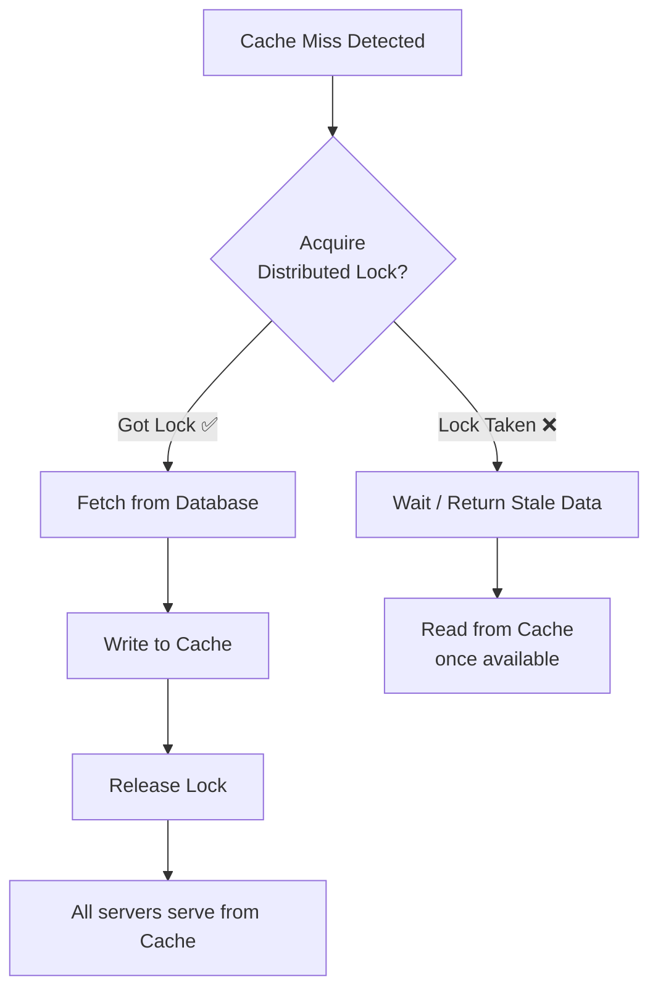

> ⚠️ **Trade-off:** Adds slight latency for waiting servers. But it's infinitely better than DB collapse.

---

### 2. 🔗 Request Coalescing (Fan-In)

**The idea:** Multiple identical requests are **merged into one** that hits the backend.

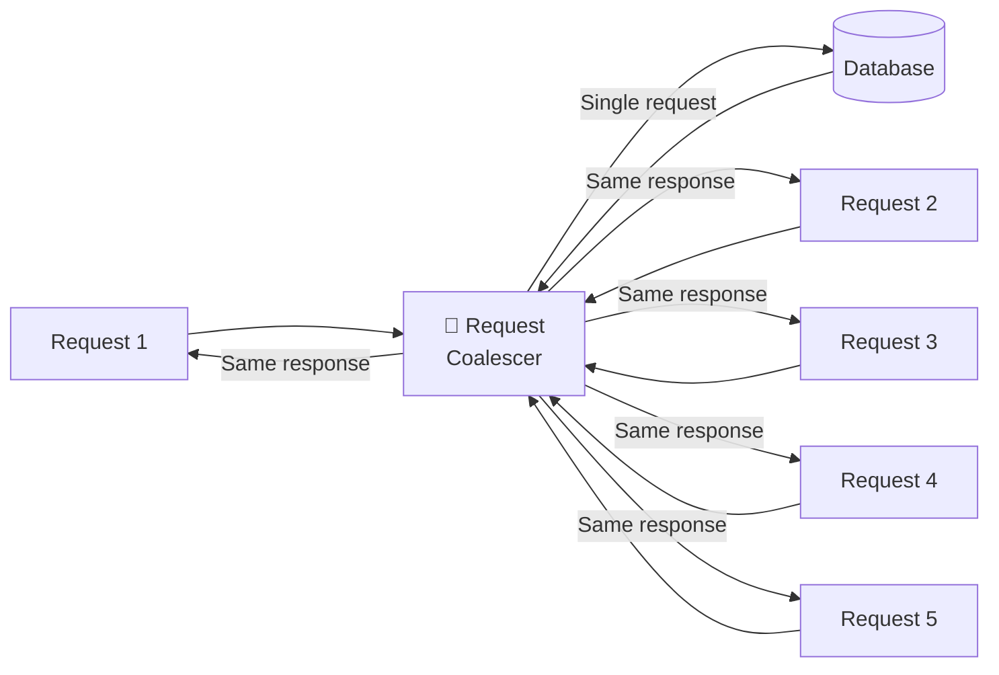

Used heavily in **CDNs** (Cloudflare, Fastly) and **API gateways**. When 1,000 users request the same resource simultaneously, only one origin fetch happens.

---

### 3. 🎲 Staggered / Probabilistic Cache Expiry

**The idea:** Instead of a hard TTL, expire items *slightly randomly* so they don't all expire together.

> 🧠 **Pro Pattern:** Netflix calls this **"probabilistic early expiration"** — a key starts refreshing *before* it expires (with some probability), ensuring the cache is always warm.

---

### 4. 📈 Exponential Backoff with Jitter

**The idea:** When a request fails, don't retry immediately. Wait — and add randomness.

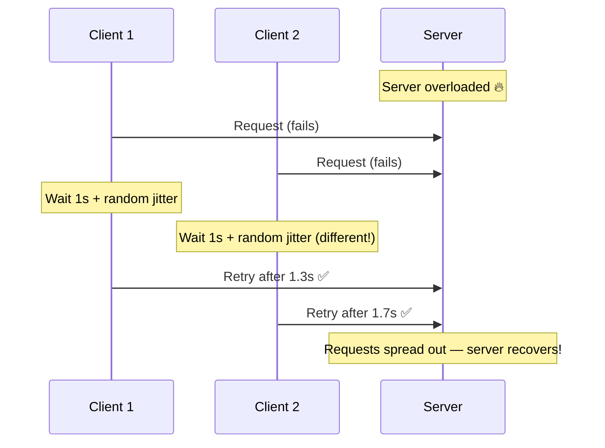

**Without jitter:** All 10,000 clients retry at second 2. Another herd. 🐃🐃🐃

**With jitter:** Clients retry across a 2–5 second window. Server breathes. 😮‍💨

---

### 5. 🚦 Rate Limiting at the Gate

**The idea:** Cap the number of requests that can reach your database or backend service.

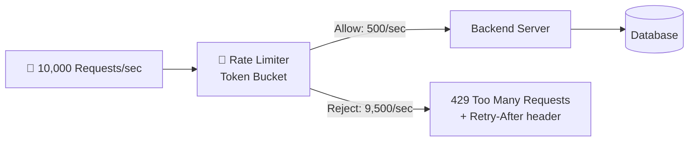

**Best practice:** Return a `Retry-After` header so clients know *when* to come back — preventing yet another synchronized retry storm.

---

## 🎭 Before vs. After: Architecture Comparison

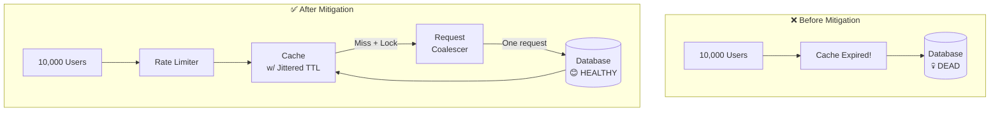

---

## 🌟 Real-World Examples That Made Headlines

| Event | What Happened | Root Cause |
|---|---|---|
| **Netflix new release** | Traffic spike on content metadata | CDN cache miss cascade |
| **IPL Final 2023** | Score apps crashed at match start | Synchronized cache warming |
| **Pokémon GO launch** | Servers down globally for days | Auth service thundering herd |
| **Reddit "front page" effect** | Linked small sites crash instantly | No rate limiting / caching |
| **Black Friday 2021** | Multiple e-commerce sites down | Inventory cache expiry under load |

> 🤩 **Mind-Blowing Fact:** The **Pokémon GO launch** in 2016 is one of the most famous thundering herd events in history. The game became 50x more popular than expected overnight. Auth servers were repeatedly hit with synchronized retry storms. Niantic had to geographically stagger launches just to prevent global collapse.

---

## 🎓 Interview Cheat Sheet

If asked about the Thundering Herd Problem in interviews, remember:

1. **Define it clearly** — Synchronized requests overwhelming a shared resource
2. **Give a cache expiry example** — Most relatable and common
3. **Mention the 5 solutions** — Cache lock, coalescing, jitter TTL, backoff, rate limiting
4. **Highlight distributed system danger** — Cascading failures, retry storms
5. **Drop a real example** — Netflix, IPL, Pokémon GO

> 💬 **Killer Answer Opener:** *"The thundering herd problem is essentially what happens when your system's defenses (like caching) fail all at once in a synchronized way — turning a protection mechanism into an attack vector against your own infrastructure."*

---

## 🏁 Conclusion: Tame the Herd

The Thundering Herd Problem is one of those invisible monsters in distributed systems. It doesn't announce itself. It waits for your cache to expire at peak traffic. It waits for your server to restart during a festival. And then — in one brutal millisecond — it stampedes.

**The good news?** Every technique we've covered is battle-tested and widely used by companies like Google, Netflix, Amazon, and Flipkart.

The lesson is simple:

> **"A system that doesn't account for synchronized failure modes will eventually fail — not from the load it was designed for, but from the synchronized noise around it."**

Build systems that are **asynchronous by nature, jittered by design, and rate-limited by default** — and the thundering herd will never find your database home.

---

*🐃 The herd is always out there. The question is: have you built the fence?*

---
