# 🐃 गरजते झुंड (Thundering Herd) की समस्या को समझें

**जब आपकी सिस्टम शहर की एकमात्र खुली दुकान बन जाती है**

---

> **"एक cache expiry. लाखों requests. बिल्कुल रहम नहीं."**

---

## 🏪 भगदड़ की शुरुआत — एक वास्तविक उदाहरण

कल्पना कीजिए आपके शहर की एक लोकप्रिय दुकान सुबह 9 बजे खुलती है।  
सामान्य दिनों में ग्राहक दिनभर धीरे-धीरे आते रहते हैं।  
लेकिन आज है **मेगा-सेल का दिन**।  
दुकान पिछली रात मेंटेनेंस के लिए बंद थी।  
और पूरे शहर को ठीक 8:59 AM पर एक ही सूचना मिलती है।  

9:00 AM बजते ही — **5,000 लोग एक ही दरवाज़े से एक साथ अंदर घुस जाते हैं।**

बिलिंग काउंटर क्रैश हो जाता है।  
शेल्फ खाली हो जाते हैं।  
सुरक्षा गार्ड संभाल नहीं पाते।  
मैनेजर घबरा जाता है।  

प्रिय developer, यही है **Thundering Herd Problem** — सर्वर और सॉफ्टवेयर की दुनिया में होने वाली यही घटना।

---

## ⚡ Thundering Herd Problem क्या है?

**Thundering Herd Problem** तब होता है जब  
**बहुत बड़ी संख्या में processes या requests एक साथ जागते या trigger होते हैं**,  
और सभी एक ही shared resource के लिए प्रतिस्पर्धा करते हैं —  
जिससे पूरी सिस्टम ओवरलोड हो जाती है।

Distributed systems में यह आमतौर पर इन परिस्थितियों में होता है:

* **Cache expire** होने पर सैकड़ों सर्वर एक साथ उसे दोबारा build करने लगते हैं
* **Backend server restart** होने पर सभी clients एक साथ reconnect करते हैं
* **Scheduled job पूरा** होने पर हजारों idle workers एक साथ सक्रिय हो जाते हैं

> 💡 **रोचक तथ्य:** “Thundering Herd” शब्द मूल रूप से operating systems में उपयोग हुआ था। जब कई processes एक ही socket `accept()` call पर wait कर रहे थे और एक साथ जाग गए — जबकि वास्तव में केवल *एक* आगे बढ़ सकता था। बाकी ने केवल CPU cycles बर्बाद किए।

---

## 🗺️ यह कहाँ होता है?

Thundering herd आपकी architecture में छिपा रहता है:

| Location           | Trigger               | Impact                                    |
| ------------------ | --------------------- | ----------------------------------------- |
| **Cache Layer**    | TTL expire            | सभी servers database पर टूट पड़ते हैं     |
| **Database**       | Connection pool खत्म  | Queries queue और timeout होती हैं         |
| **Load Balancer**  | Server restart        | Queued requests एक node पर flood होती हैं |
| **Message Queues** | बड़ा batch release    | Consumers crash हो जाते हैं               |
| **Microservices**  | Service online आती है | सभी retry attempts एक साथ hit करते हैं    |

> *TTL (Time To Live) वह समय सीमा है जिसके बाद cache में रखा गया data अपने-आप expire होकर हट जाता है। ⏳*
---

## 🏗️ क्लासिक Architecture: App → Cache → DB

अधिकांश web systems में flow इस प्रकार होता है:

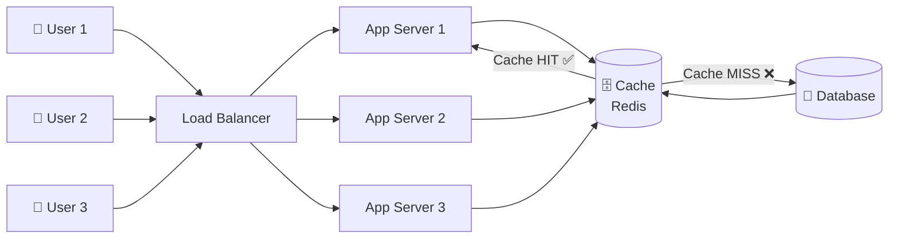

**Cache hit होने पर:** तेज़ response मिलता है, database शांत रहता है। 😌

**Cache miss होने पर:** एक server DB से data लाता है और cache में store करता है। अभी भी संभालने योग्य है।

**लेकिन जब cache expire हो जाए और key hot हो…** 🚨
यहीं से herd दौड़ता है।

> *Hot key वह data key है जिसे बहुत सारे users एक ही समय में बार-बार access करते हैं, जिससे सिस्टम पर ज्यादा load पड़ता है।*
> *IPL Final के दौरान live_score cache key, जिसे लाखों लोग एक ही समय पर बार-बार refresh करते हैं — यही एक hot key है। 🔥*

---

## 🔥 असली ड्रामा: Cache Expiry से Request Spike

मान लीजिए **IPL Final** 🏏 की रात है।  
आपका cricket score app 5,00,000 users serve कर रहा है।  
Redis में data cache है और **TTL = 60 seconds** है।

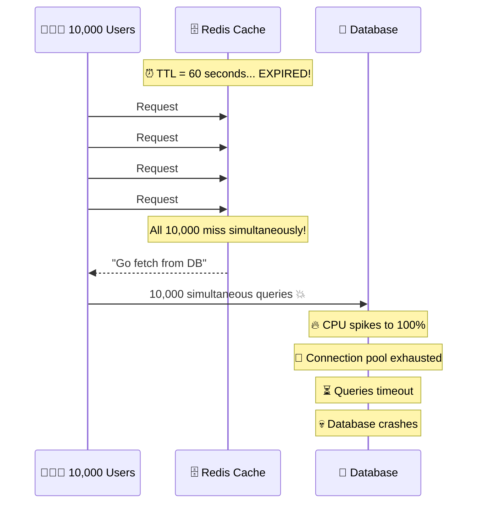

**एक cache key expire हुआ। 10,000 requests DB पर पहुँचे। और database down हो गया।**

> 🤯 **अविश्वसनीय पर सत्य:** 2023 Cricket World Cup के दौरान कुछ sports apps में “live score” cache key expire होने से cascading database failure हुआ और लाखों users के लिए service down हो गई।

---

## 📊 Normal Spike vs Thundering Herd

हर traffic spike thundering herd नहीं होता।

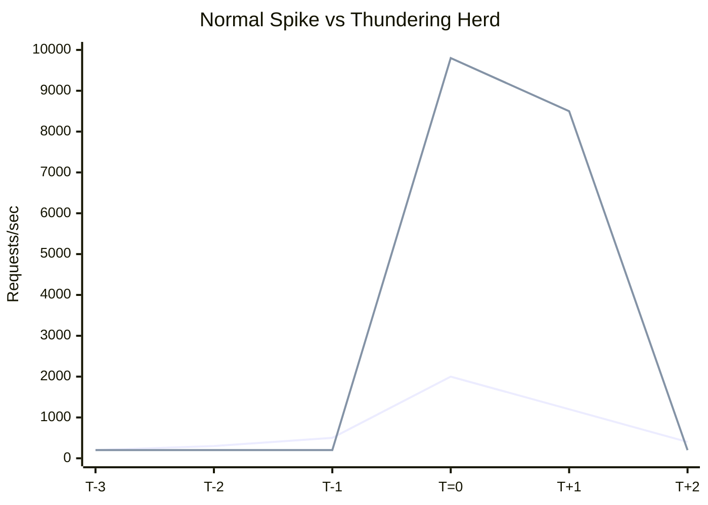

| Attribute | Normal Spike          | Thundering Herd      |
| --------- | --------------------- | -------------------- |
| Shape     | धीरे-धीरे बढ़त        | अचानक vertical jump  |
| Cause     | User activity         | Synchronized event   |
| Duration  | मिनटों तक             | milliseconds–seconds |
| Impact    | Scale से संभल सकता है | विनाशकारी            |

> **मुख्य बात:** Thundering herd volume का नहीं — synchronization का मुद्दा है।

---

## 🌐 Distributed Systems में यह क्यों खतरनाक है?

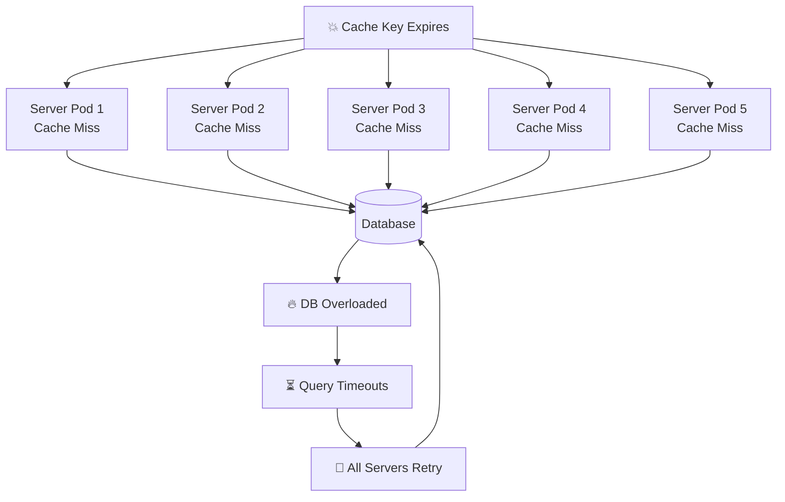

Servers retry करते हैं — और दूसरी झुंड लहर बनती है।
यह **cascading failure** पूरे platform को गिरा सकती है।

> 💡 Amazon के अध्ययन के अनुसार केवल 500ms latency बढ़ने से 1% sales कम हो गई — और इसके पीछे कई बार thundering herd events थे।

---

## 💀 प्रभाव: CPU, Database, Cache, Latency

### 🖥️ CPU पर प्रभाव

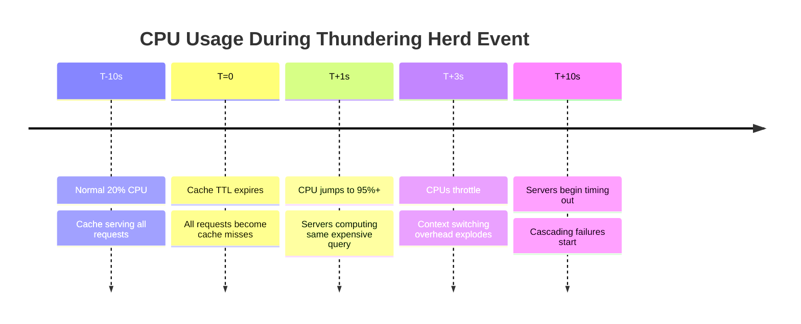

* सभी servers एक साथ समान computation करते हैं
* Context switching बढ़ती है
* Duplicate काम होता है
* अंत में केवल एक ही result मिलता है

### 💾 Database पर प्रभाव

* Connection pool तुरंत भर जाता है
* Queries queue होती हैं
* Deadlocks बनते हैं
* DB connections reject करने लगता है

> 🎯 Interview tip: Database हर query execute करता है — भले ही वह 10,000 बार identical हो।

### 🗄️ Cache पर प्रभाव

* Multiple writes → write contention
* Stale data का जोखिम
* Inconsistency

### ⏱️ Latency में उछाल

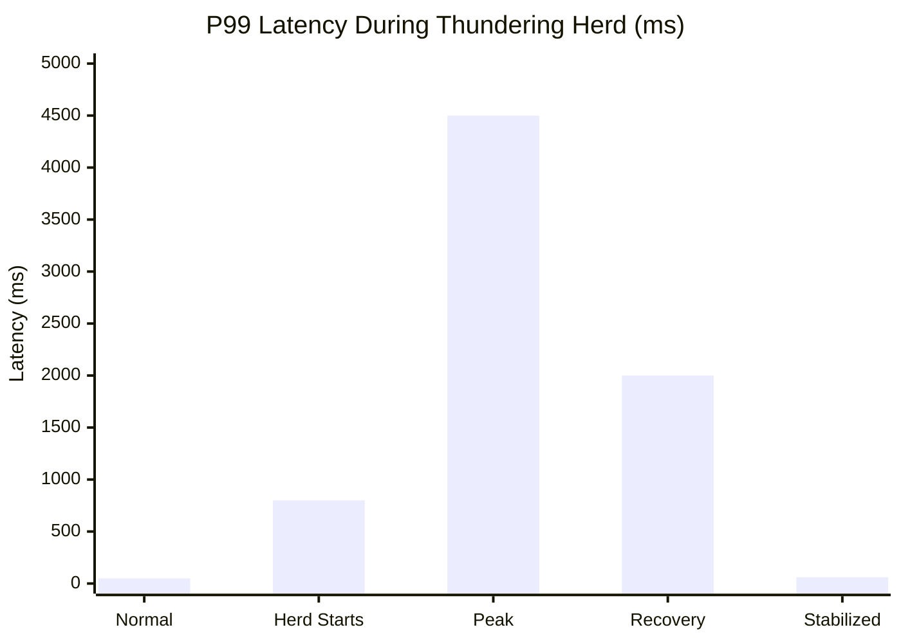

P99 latency 50ms से बढ़कर 4500ms तक जा सकती है।

Users देखते हैं:

* Loader घूमता रहता है
* “Something went wrong”
* App crash

---

## 🛡️ समाधान — झुंड को कैसे रोकें?

---

### 1. 🔒 Cache Lock / Mutex

**मुख्य विचार:** केवल *एक* server cache rebuild करेगा। बाकी इंतजार करेंगे।

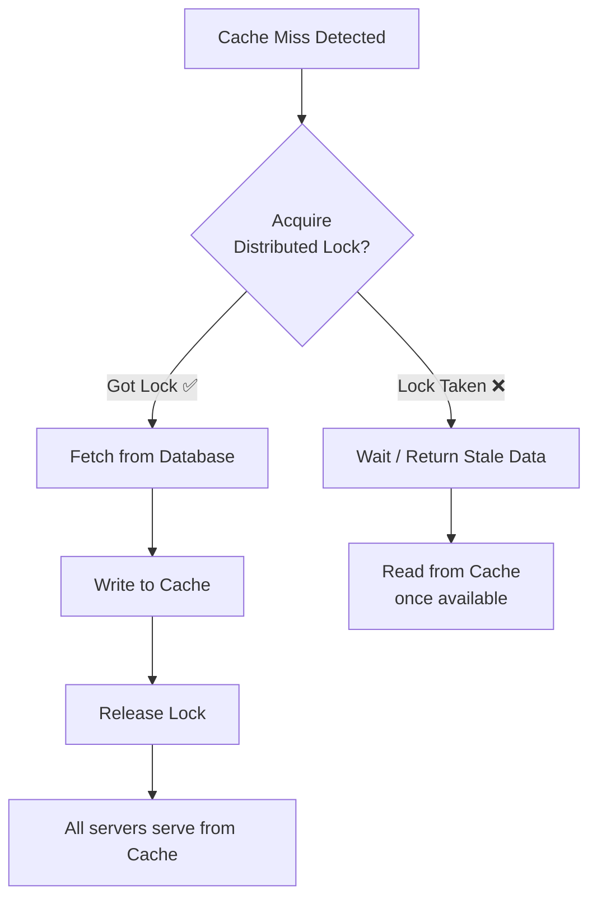

⚠️ **Trade-off:** इंतज़ार कर रहे servers के लिए थोड़ी अतिरिक्त latency बढ़ जाती है। लेकिन DB के collapse होने से यह अनंत गुना बेहतर है।

---

### 2. 🔗 Request Coalescing

**मुख्य विचार:** कई समान requests को **एक में merge कर दिया जाता है**, और वही एक request backend तक जाती है।

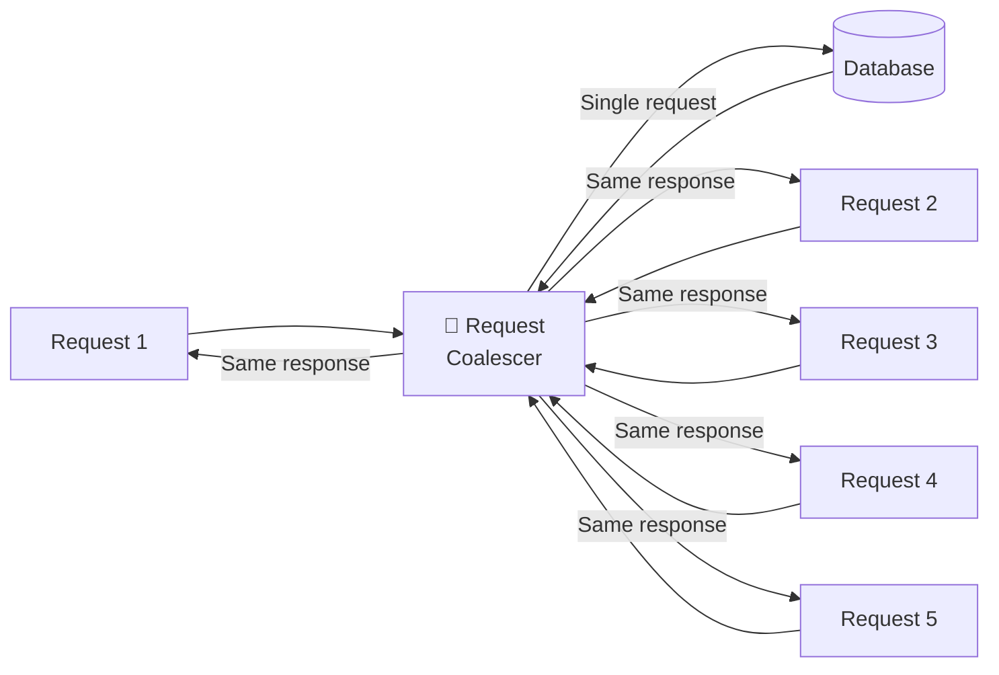

यह तरीका **CDNs** (Cloudflare, Fastly) और **API gateways** में व्यापक रूप से उपयोग किया जाता है।   
जब 1,000 users एक ही resource को एक साथ request करते हैं, तो केवल एक ही origin fetch होता है।

---

### 3. 🎲 Staggered TTL

**मुख्य विचार:** Hard TTL की बजाय items को थोड़ा random तरीके से expire करें, ताकि वे सभी एक साथ expire न हों।  

🧠 **Pro Pattern:** Netflix इसे **"probabilistic early expiration"** कहता है — यानी कोई key expire होने से पहले ही (कुछ probability के साथ) refresh होना शुरू कर देती है, जिससे cache हमेशा warm रहता है।

---

### 4. 📈 Exponential Backoff + Jitter

**मुख्य विचार:** जब कोई request fail हो जाए तो तुरंत retry न करें। थोड़ा इंतज़ार करें — और उसमें randomness (jitter) जोड़ें।

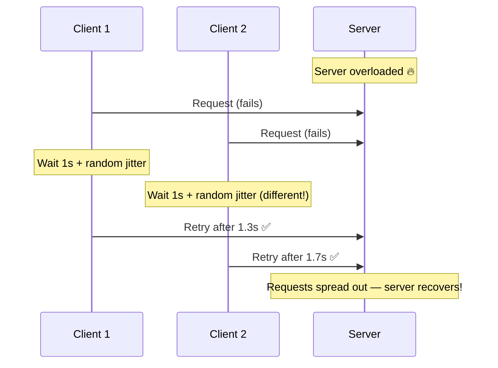

**Jitter के बिना:** सभी 10,000 clients दूसरे सेकंड में एक साथ retry करते हैं। फिर से एक herd बन जाता है। 🐃🐃🐃  
**जिटर के साथ:** क्लाइंट 2–5 सेकंड की विंडो में फिर से कोशिश करते हैं। सर्वर सांस लेता है। 😮‍💨

---

### 5. 🚦 Rate Limiting at the Gate

**The idea:** आपके डेटाबेस या बैकएंड सर्विस तक पहुंचने वाले request की संख्या को लिमिट करें।

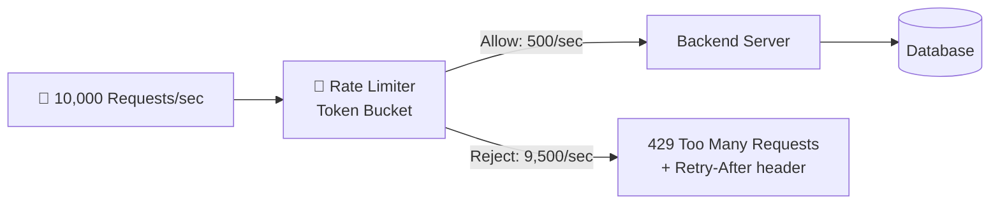

**Best practice:** `Retry-After` header वापस भेजें, ताकि clients को *कब दोबारा प्रयास करना है* यह पता चले — और एक और synchronized retry storm होने से बचा जा सके।

---

## 🎭 Before vs After

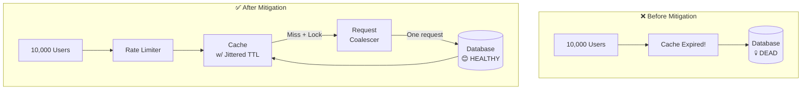

---

## 🌟 चर्चित वास्तविक उदाहरण

| Event               | Root Cause             |
| ------------------- | ---------------------- |
| Netflix new release | CDN cache miss         |
| IPL Final 2023      | Cache warming issue    |
| Pokémon GO launch   | Auth retry storm       |
| Reddit effect       | No caching             |
| Black Friday        | Inventory cache expiry |

> 🤩 Pokémon GO launch 2016 में auth servers पर synchronized retry storm के कारण global outage हुआ।

---

## 🎓 Interview Cheat Sheet

1. Definition स्पष्ट बताएं
2. Cache expiry example दें
3. 5 solutions बताएं
4. Cascading failure समझाएं
5. Real example दें

---

## 🏁 निष्कर्ष: झुंड को काबू में करें

Thundering Herd Problem distributed systems का अदृश्य राक्षस है।  
यह peak traffic का इंतज़ार करता है।  
यह server restart का इंतज़ार करता है।  
और फिर एक millisecond में दौड़ पड़ता है।  

लेकिन अच्छी खबर यह है —
Google, Netflix, Amazon, Flipkart जैसी कंपनियाँ इस समस्या को पहले ही हल कर चुकी हैं।

> **"जो सिस्टम synchronized failure modes को ध्यान में नहीं रखती, वह अपने design किए गए load से नहीं, बल्कि synchronized noise से fail होती है।"**

System design करते समय:

* asynchronous सोचें
* jitter का उपयोग करें
* rate limiting को default रखें

तब झुंड कभी भी आपके database तक नहीं पहुँचेगा।

---

*🐃 झुंड हमेशा बाहर मौजूद है। सवाल बस इतना है — क्या आपने बाड़ लगा ली है?*

---

