# 🐃 गडगडणाऱ्या कळपाची समस्या समजणे

**जेव्हा तुमची सिस्टिम शहरातील एकमेव उघडं दुकान बनते**

---

> **"एक cache expiry. लाखो requests. अजिबात दया नाही."**

---

## 🏪 धावपळीची सुरुवात — एक वास्तविक उदाहरण

कल्पना करा तुमच्या शहरातील एक लोकप्रिय दुकान सकाळी ९ वाजता उघडतं.  
साधारण दिवशी ग्राहक दिवसभर थोड्या-थोड्या प्रमाणात येतात.  
पण आज आहे **मेगा-सेलचा दिवस**.  
दुकान काल मेंटेनन्ससाठी बंद होतं.  
आणि शहरातील प्रत्येकाला बरोबर ८:५९ AM ला सूचना मिळाली.  

९:०० AM वाजता — **५,००० लोक एकाच वेळी एकाच दरवाजातून आत घुसतात.**

बिलिंग काउंटर क्रॅश होतो.  
शेल्फ रिकामे होतात.  
सिक्युरिटी गार्ड गोंधळून जातात.  
मॅनेजरला ब्रेकडाउन येतो.  

प्रिय developer, हेच आहे **Thundering Herd Problem** — सर्व्हर आणि सॉफ्टवेअरच्या जगात घडणारी हीच घटना.

---

## ⚡ Thundering Herd Problem म्हणजे काय?

**Thundering Herd Problem** तेव्हा घडतो जेव्हा  
**मोठ्या प्रमाणात processes किंवा requests एकाच वेळी जाग्या होतात किंवा trigger होतात**,  
आणि सगळे एकाच shared resource साठी स्पर्धा करतात — ज्यामुळे संपूर्ण सिस्टिम ओव्हरलोड होते.

Distributed systems मध्ये हे साधारणपणे खालील परिस्थितीत घडतं:

* **Cache expire** झाल्यावर शेकडो सर्व्हर्स एकाच वेळी ते पुन्हा build करण्याचा प्रयत्न करतात
* **Backend server restart** झाल्यावर सर्व clients एकाच वेळी reconnect करतात
* **Scheduled job complete** झाल्यावर हजारो idle workers एकाच वेळी जागे होतात

> 💡 **रोचक माहिती:** "Thundering Herd" हा शब्द मूळतः operating systems मध्ये वापरला गेला. जेव्हा अनेक processes एकाच socket `accept()` call वर wait करत होते आणि एकाच वेळी जागे झाले — पण प्रत्यक्षात फक्त *एकच* पुढे जाऊ शकत होता. बाकीच्यांनी फक्त CPU cycles वाया घालवले.

---

## 🗺️ हे कुठे घडतं?

Thundering herd तुमच्या architecture मध्ये लपलेला असतो:

| Location           | Trigger               | Impact                                  |
| ------------------ | --------------------- | --------------------------------------- |
| **Cache Layer**    | TTL expire            | सर्व servers database वर तुटून पडतात    |
| **Database**       | Connection pool संपतो | Queries queue होतात आणि timeout होतात   |
| **Load Balancer**  | Server restart        | Queued requests एका node वर flood होतात |
| **Message Queues** | मोठा batch release    | Consumers crash होतात                   |
| **Microservices**  | Service online येते   | सर्व retry attempts एकदम hit करतात      |

> *TTL (Time To Live) म्हणजे cache मध्ये ठेवलेला data किती वेळानंतर आपोआप expire होऊन काढून टाकला जाईल, याची वेळ मर्यादा. ⏳*

---

## 🏗️ क्लासिक Architecture: App → Cache → DB

साधारण web system मध्ये flow असा असतो:

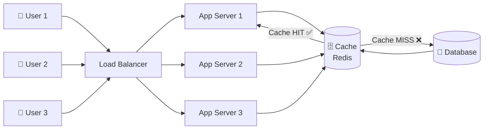

**Cache hit असेल तर:** response जलद मिळतो, database शांत असतो. 😌

**Cache miss असेल तर:** एक server DB कडून डेटा आणतो आणि cache मध्ये ठेवतो. अजूनही manageable आहे.

**पण cache expire झाला आणि key hot असेल तर?** 🚨
इथेच कळप धावतो.

> *Hot key म्हणजे असा data key ज्याला खूप सारे users एकाच वेळी वारंवार access करतात, त्यामुळे सिस्टिमवर जास्त load येतो.*
> *IPL Final दरम्यान live_score cache key, ज्याला लाखो लोक एकाच वेळी वारंवार refresh करतात — हाच एक hot key आहे. 🔥*

---

## 🔥 खरा ड्रामा: Cache Expiry मुळे Request Spike

कल्पना करा **IPL Final** 🏏 ची रात्र आहे.  
तुमचं cricket score app ५,००,००० users serve करत आहे.  
Redis मध्ये data cache केला आहे आणि **TTL = 60 seconds** आहे.

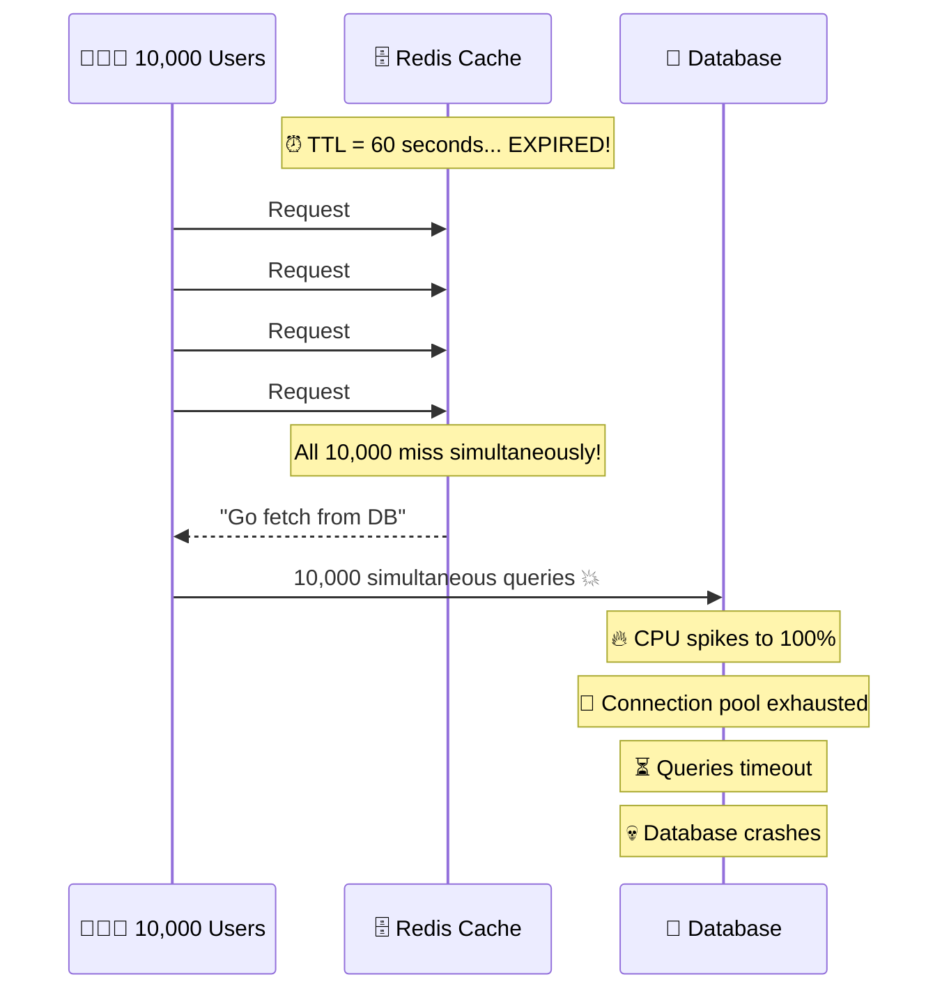

**एक cache key expire झाला. १०,००० requests DB वर गेले. आणि database down झाला.**

> 🤯 **अविश्वसनीय पण खरं:** 2023 Cricket World Cup दरम्यान काही sports apps मध्ये "live score" cache key expire झाल्यामुळे cascading database failure झाला आणि लाखो users साठी service down झाली.

---

## 📊 Normal Spike vs Thundering Herd

सर्व traffic spike हे thundering herd नसतात.

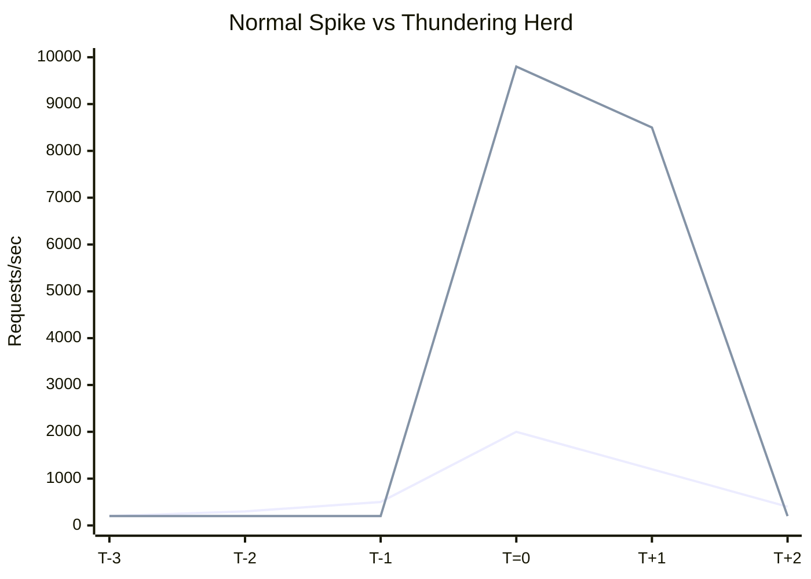

| Attribute | Normal Spike               | Thundering Herd      |
| --------- | -------------------------- | -------------------- |
| Shape     | हळूहळू वाढ                 | अचानक vertical jump  |
| Cause     | User activity              | Synchronized event   |
| Duration  | मिनिटे                     | milliseconds–seconds |
| Impact    | Scale करून handle होऊ शकतो | Catastrophic         |

> **महत्वाचा मुद्दा:** Thundering herd हा volume बद्दल नाही — तो synchronization बद्दल आहे.

---

## 🌐 Distributed Systems मध्ये का धोकादायक?

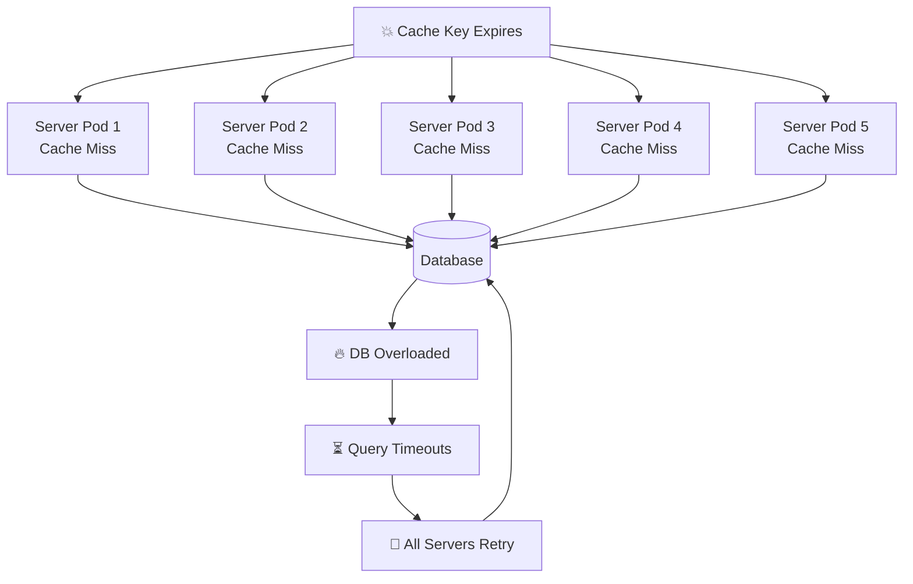

Servers retry करतात — आणि दुसरी herd wave तयार होते.
ही **cascading failure** पूर्ण platform खाली आणू शकते.

> 💡 Amazon च्या अभ्यासानुसार फक्त 500ms latency वाढल्यास 1% sales कमी झाले — आणि त्यामागे अनेकदा thundering herd events होते.

---

## 💀 परिणाम: CPU, Database, Cache, Latency

### 🖥️ CPU वर परिणाम

* सर्व servers एकाच वेळी समान computation करतात
* Context switching वाढते
* Duplicate काम होतं
* शेवटी एकच result मिळतो

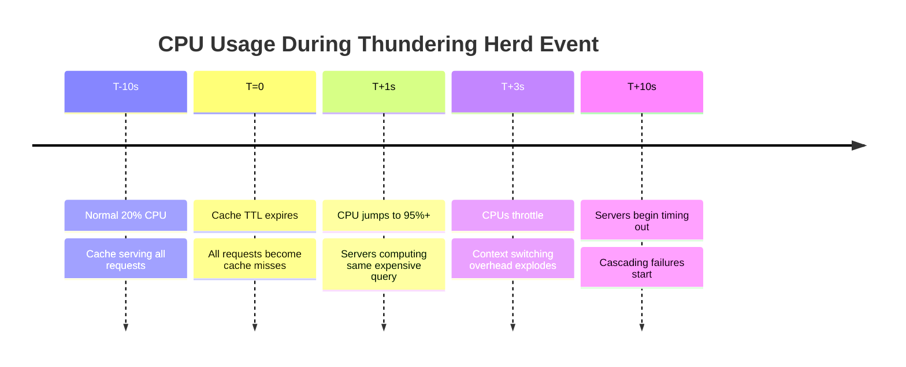

### 💾 Database वर परिणाम

* Connection pool ताबडतोब भरतो
* Queries queue होतात
* Deadlocks होतात
* DB connections reject करतो

> 🎯 Interview tip: Database प्रत्येक query execute करतो — जरी ती १०,००० वेळा identical असली तरी.

### 🗄️ Cache वर परिणाम

* Multiple writes → write contention
* Stale data risk
* Inconsistency

### ⏱️ Latency वाढ

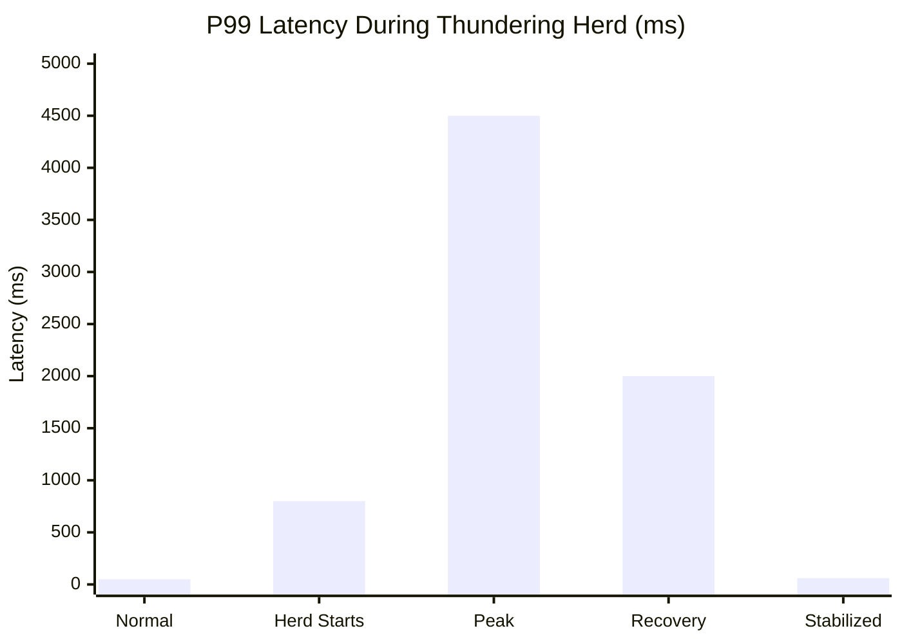

P99 latency 50ms वरून 4500ms पर्यंत जाऊ शकते.

Users पाहतात:

* Loader फिरत राहतो
* “Something went wrong”
* App crash

---

## 🛡️ उपाय — कळप कसा थांबवायचा?

---

### 1. 🔒 Cache Lock / Mutex Lock

**मूल कल्पना:** फक्त *एकच* server cache rebuild करेल. बाकी वाट पाहतील.

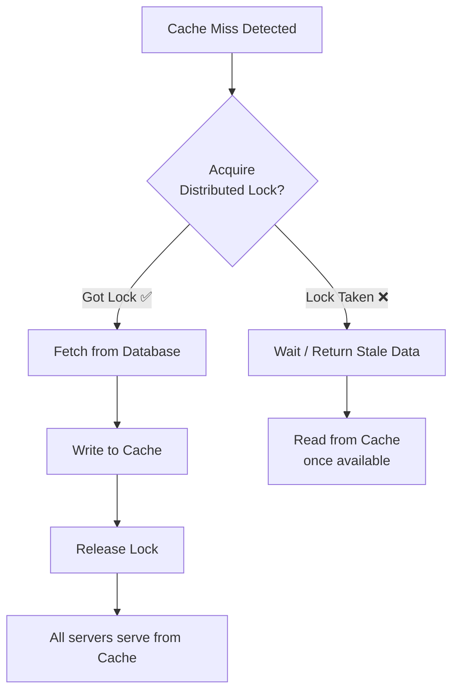

⚠️ **Trade-off:** वाट पाहणाऱ्या servers साठी थोडी अतिरिक्त latency वाढते. पण DB collapse होण्यापेक्षा हे कितीतरी पटीनं चांगलं आहे.

---

### 2. 🔗 Request Coalescing

**मूल कल्पना:** एकसारख्या अनेक requests **एकामध्ये merge केल्या जातात**, आणि ती एकच request backend पर्यंत पोहोचते.

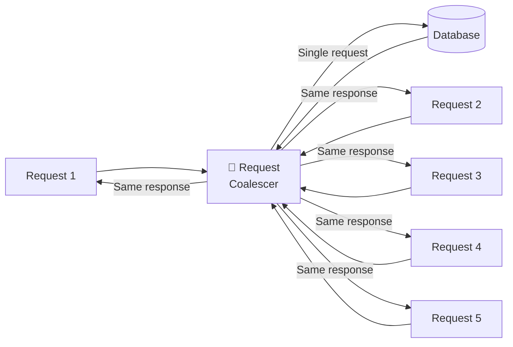

हा pattern **CDNs** (Cloudflare, Fastly) आणि **API gateways** मध्ये मोठ्या प्रमाणावर वापरला जातो. जेव्हा 1,000 users एकाच वेळी समान resource मागतात, तेव्हा फक्त एकच origin fetch केला जातो.

---

### 3. 🎲 Staggered TTL

**मूल कल्पना:** ठराविक (hard) TTL वापरण्याऐवजी, items थोड्याशा random पद्धतीने expire करा, जेणेकरून ते सगळे एकाच वेळी expire होणार नाहीत.

> 🧠 **Pro Pattern:** Netflix याला **"probabilistic early expiration"** म्हणतो — म्हणजे एखादी key expire होण्यापूर्वीच (काही probability ने) refresh होऊ लागते, ज्यामुळे cache नेहमी warm राहतो.

---

### 4. 📈 Exponential Backoff + Jitter

**मूल कल्पना:** एखादी request fail झाली तर लगेच retry करू नका. थोडा वेळ थांबा — आणि त्यात randomness (jitter) जोडा.

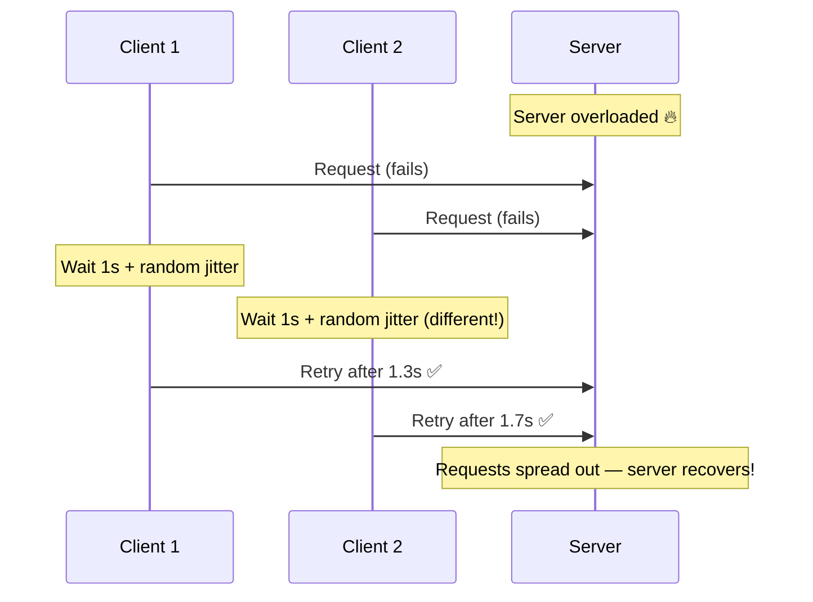

**Jitter नसल्यास:** सर्व 10,000 clients 2ऱ्या सेकंदाला पुन्हा retry करतात. पुन्हा एक herd तयार होतो. 🐃🐃🐃

**Jitter असल्यास:** Clients 2–5 सेकंदांच्या window मध्ये वेगवेगळ्या वेळी retry करतात. Server ला श्वास घेता येतो. 😮‍💨

---

### 5. 🚦 Rate Limiting

Database पर्यंत पोहोचणाऱ्या requests मर्यादित करा.

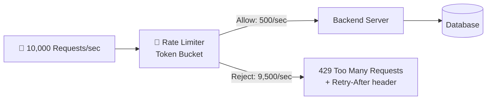

**Best practice:** `Retry-After` header परत करा, जेणेकरून clients ना *कधी परत प्रयत्न करायचा* हे समजेल — आणि पुन्हा एकदा synchronized retry storm होण्यापासून बचाव होईल.

---

## 🎭 Before vs After

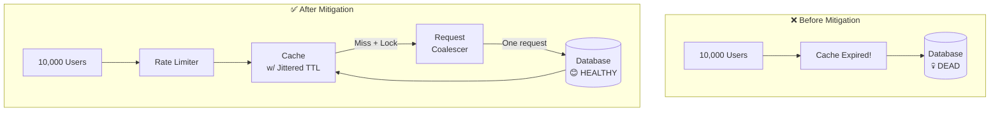

---

## 🌟 प्रसिद्ध उदाहरणे

| Event               | Root Cause             |
| ------------------- | ---------------------- |
| Netflix new release | CDN cache miss         |
| IPL Final 2023      | Cache warming issue    |
| Pokémon GO launch   | Auth retry storm       |
| Reddit effect       | No caching             |
| Black Friday        | Inventory cache expiry |

> 🤩 Pokémon GO launch 2016 मध्ये auth servers वर synchronized retry storm मुळे global outage झाला.

---

## 🎓 Interview Cheat Sheet

1. Definition स्पष्ट सांगा
2. Cache expiry example द्या
3. 5 solutions mention करा
4. Cascading failure explain करा
5. Real example द्या

---

## 🏁 निष्कर्ष: कळपाला सांभाळा

Thundering Herd Problem हा distributed systems मधला अदृश्य राक्षस आहे.  
तो peak traffic ची वाट पाहतो.  
तो server restart ची वाट पाहतो.  
आणि मग एका millisecond मध्ये धावतो.  

पण चांगली बातमी अशी की —  
Google, Netflix, Amazon, Flipkart सारख्या कंपन्यांनी हे pattern आधीच सोडवलं आहे.

> **"Synchronization लक्षात न घेणारी system शेवटी load मुळे नाही, तर synchronized noise मुळे fail होते."**

System design करताना:

* asynchronous विचार करा
* jitter वापरा
* rate limiting default ठेवा

मग कळप कधीच तुमच्या database पर्यंत पोहोचणार नाही.

---

*🐃 कळप बाहेर नेहमीच असतो. प्रश्न इतकाच — तुम्ही कुंपण बांधलं आहे का?*

---

